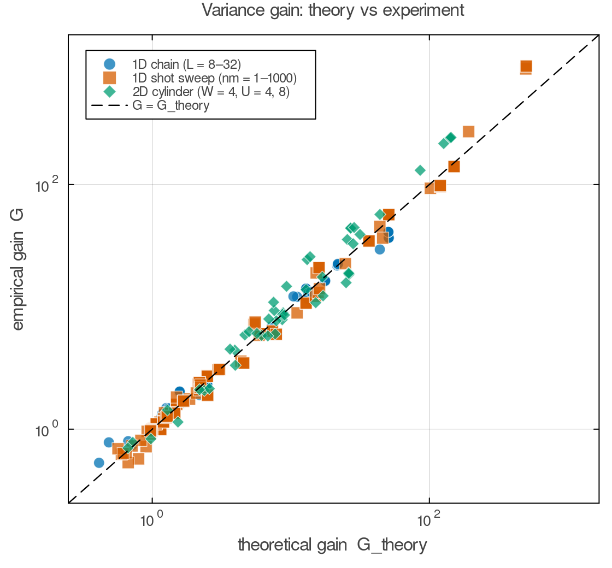
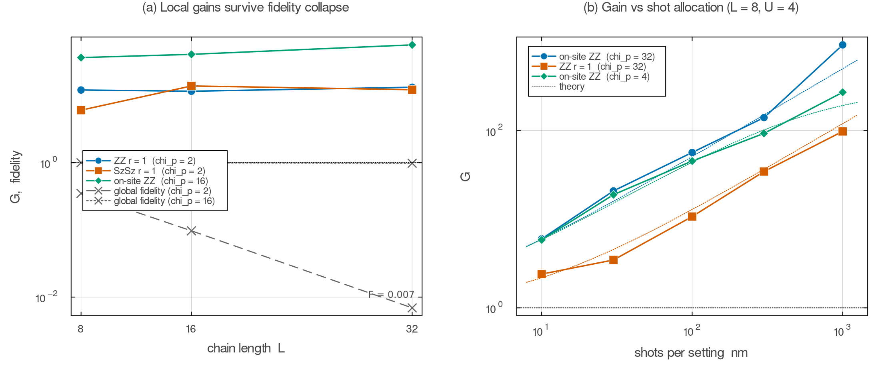
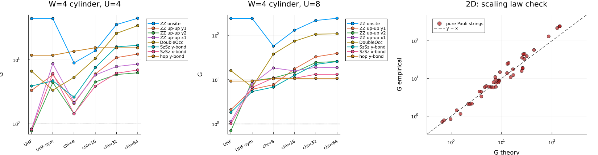
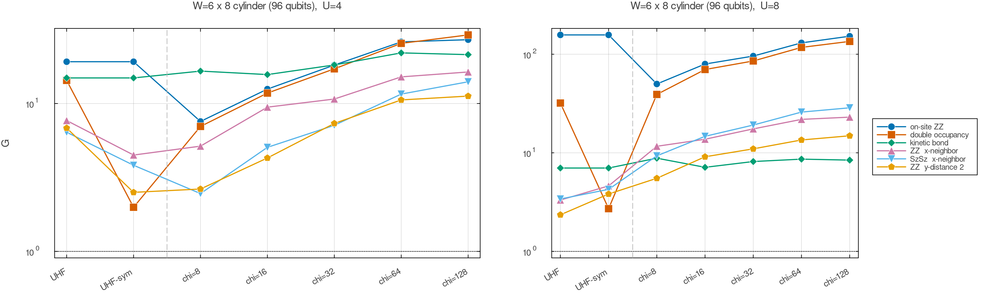
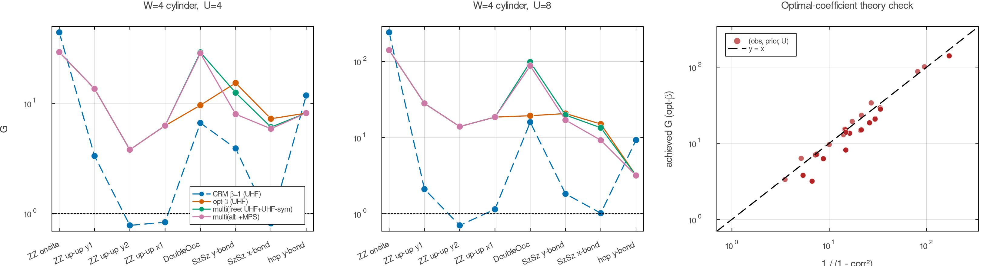
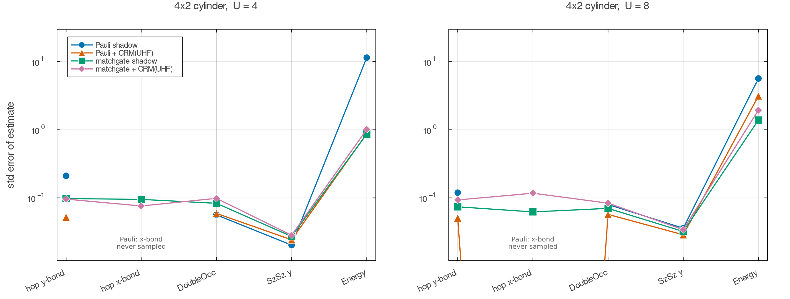

# CRMシャドウによるハバード模型の測定効率化

古典シャドウ(ランダム測定)に「古典計算で作った近似状態 (prior)」を組み合わせて測定コストを削減する **CRM (common randomized measurements)** [[Vermersch et al., PRX Quantum 5, 010352 (2024)](https://doi.org/10.1103/PRXQuantum.5.010352)] を、ハバード模型に系統的に適用した研究の作業ディレクトリです。

**一言でいうと**: 「量子実験の測定コストは、手元の安い理論近似で大幅に値切れる。しかも近似は下手でよく、測りたい量の近くだけ合っていればよい」ことを、理論式と数値実験(最大96量子ビット)の両方で示しました。

詳細な研究ノート(論文構成・数式・査読対応まで): **[CRM_RESEARCH_NOTES.md](CRM_RESEARCH_NOTES.md)**

---

## 主要な結果

### 1. 利得は「priorの局所誤差」だけで決まる(理論式を5桁で検証)

CRMの分散削減率(利得 G)は閉形式

$$G = \frac{(3^{|A|}-1)\langle P\rangle^2 + v_s}{(3^{|A|}-1)\Delta^2 + v_s}, \qquad \Delta = \langle P\rangle_\rho - \langle P\rangle_\sigma$$

で書け、**priorのグローバル忠実度は登場しない**。1D鎖・ショット配分掃引・2Dシリンダーの全データ(218点)が理論線 y=x に乗る。



### 2. グローバル忠実度が崩壊しても局所観測量の利得は生き残る

L=32鎖で忠実度 **F=0.007**(ほぼ直交)の粗いpriorでも、局所観測量の測定コストは10分の1以上節約できる(左)。CRMを使うなら「少ない測定設定×多ショット」の配分が得(右、飽和則も理論と一致)。



### 3. 2Dでは「タダの平均場prior」が高価なMPS priorに匹敵する

W=4シリンダー(64量子ビット)では切断MPS priorが急劣化(χ=8で忠実度0.055)する一方、$O(N^3)$ のUHF平均場は**Wickの定理だけで**prior側を厳密計算でき、オンサイト量でχ=32–64のMPS並みの利得(U=8で G=241)。弱点だったサイト間スピン相関は、スピン回転平均した**混合状態prior(対称性回復UHF)**で修復。



**W=6(96量子ビット、研究室クラスターでのPBS計算)**では、MPS priorの劣化がさらに加速(χ=8で0.018)する一方UHFは持ちこたえ、**安いpriorの相対優位は幅とともに拡大**することを確認。



### 4. 「損をしないCRM」— 最適係数と多prior回帰

CRMは統計学の制御変量法のβ=1特殊例。係数βを同じデータから推定すると $G = 1/(1-\mathrm{corr}^2) \geq 1$ となり、**priorがどんなに悪くても損をしない**(β=1で損をしていた全ケースが修復)。複数priorの回帰では、**タダのprior2つだけでχ=32 MPS相当**の利得に達する例も(二重占有: G=98 vs 101)。



### 5. matchgate(フェルミオン)シャドウ: JW弦問題の解消と、CRMの適用範囲

2次元をJordan-Wigner変換するとx方向ホッピングに長い演算子の弦が付き、Pauliシャドウでは**事実上測定不能**(5000設定で一度もサンプルされない)。matchgateシャドウ(ランダムGauss回転)ならx-bondもy-bondと同精度で測れ、エネルギー誤差は約13分の1。一方、**CRMはmatchgateにはほぼ効かない**(nm=3000でも~2倍止まり): Gauss測定は自己平均的で「打ち消すべき設定間揺らぎ」自体が小さい。**CRMの価値は測定アンサンブル依存**という重要な知見。



### 6. 正直なベースライン比較: 貪欲derandomizationとの守備範囲分け

既知の固定観測量リストに対しては貪欲derandomization(決定論的な測定計画)が最強。ただしCRMはシャドウの不利をほぼ埋め(構造化23観測量で中央値誤差 0.059→0.012、derandは0.0085)、**測定後に任意の観測量を選べる柔軟性**を保つ。ランダム150観測量ではCRMが**最悪誤差を半減**(誤差の大きい観測量を自動的に狙い撃つ)。→ 「リスト既知ならderandomize、事後選択・多目的ならシャドウ+CRM」。

---

## 経緯として重要だった発見

- **出発点のバグ**: 既存実装([CRM_Hubbard.ipynb](CRM_Hubbard.ipynb)系列)ではprior側も有限ショットでサンプルしており、その独立ノイズのせいで「CRMが標準シャドウに負ける」結果になっていた。**prior側は厳密計算する**のが正しく、修正後はCRMが理論通り勝つ([crm_gain_verification.jl](crm_gain_verification.jl))。
- **Pauli+CRMの隠れバイアス**: 実質測定不能な項(JW弦付きx-bond)のCRM推定は「priorの値そのもの」を返すため、一見精度が良くてもpriorの誤差ぶんバイアスする。
- **多項観測量の利得は項ごとのΔで決まる**: 参照状態が対称性を破っている場合、対称化priorは合計Δ不変でも損をしうる(→観測量ごとのprior選択、最適βが保険)。

## ファイル一覧(実験の実行順)

| スクリプト | 内容 | 主要な出力 |
|---|---|---|
| [crm_gain_verification.jl](crm_gain_verification.jl) | 8量子ビットED系。推定器修正と理論式検証 | [crm_gain_verification.png](crm_gain_verification.png) |
| [crm_mps_scaling.jl](crm_mps_scaling.jl) | 1D鎖 L=8/16/32。局所性の実証(窓サンプリング導入) | [crm_mps_scaling.png](crm_mps_scaling.png) |
| [crm_param_sweep.jl](crm_param_sweep.jl) | nm掃引とU・ドーピング掃引 | [crm_param_sweep.png](crm_param_sweep.png) |
| [crm_2d_cylinder.jl](crm_2d_cylinder.jl) | W=4シリンダー。UHF vs MPS prior (Wick閉形式) | [crm_2d_cylinder.png](crm_2d_cylinder.png) |
| [crm_2d_symuhf.jl](crm_2d_symuhf.jl) | +対称性回復UHF(混合状態prior) | [crm_2d_symuhf.png](crm_2d_symuhf.png) |
| [crm_optimal_beta.jl](crm_optimal_beta.jl) | 最適係数CRM・多prior回帰 | [crm_optbeta.png](crm_optbeta.png) |
| [crm_matchgate.jl](crm_matchgate.jl) | matchgateシャドウ×CRM (Pfaffian厳密prior側) | [crm_matchgate.png](crm_matchgate.png) |
| [crm_matchgate_nm.jl](crm_matchgate_nm.jl) | matchgateのショット数掃引 | [crm_matchgate_nm.tsv](crm_matchgate_nm.tsv) |
| [crm_derand_benchmark.jl](crm_derand_benchmark.jl) | 多観測量同時推定 vs 貪欲derandomization | [crm_derand_results.tsv](crm_derand_results.tsv) |
| [crm_2d_w6.jl](crm_2d_w6.jl) + [crm_2d_w6.pbs](crm_2d_w6.pbs) | W=6×8(96量子ビット)。クラスターPBS実行 | [crm_2d_w6.png](crm_2d_w6.png) |
| [crm_paper_figures.jl](crm_paper_figures.jl) | 保存済みTSVから清書図 Fig1–3 を再生成 | crm_fig1–3 |

すべての数値実験は自己完結スクリプトで、規約(JW符号・Wick式・サンプラー等)は密行列との突き合わせで機械精度のassert検証済み(検証一覧は[ノート§2.5](CRM_RESEARCH_NOTES.md)参照)。

## 再現方法

```bash
cd examples/tatsuyama
# 初回のみ: julia --project=Hubbard_MPS_Env_v2 -e 'using Pkg; Pkg.instantiate()'
JULIA_LOAD_PATH="@:@v#.#:@stdlib" julia --project=Hubbard_MPS_Env_v2 <script>.jl
```

W=6のクラスター実行(PBS):

```bash
qsub -v UVAL=4.0 crm_2d_w6.pbs
qsub -v UVAL=8.0 crm_2d_w6.pbs
```

## 今後の課題

[ノート§5](CRM_RESEARCH_NOTES.md)参照。主要な残り: prior-informed derandomization(priorで測定計画自体を設計する統合)、最終図のブートストラップCI、ドープ2D(ストライプUHF)、動力学・有限温度Gauss prior、matchgate版分散理論。
