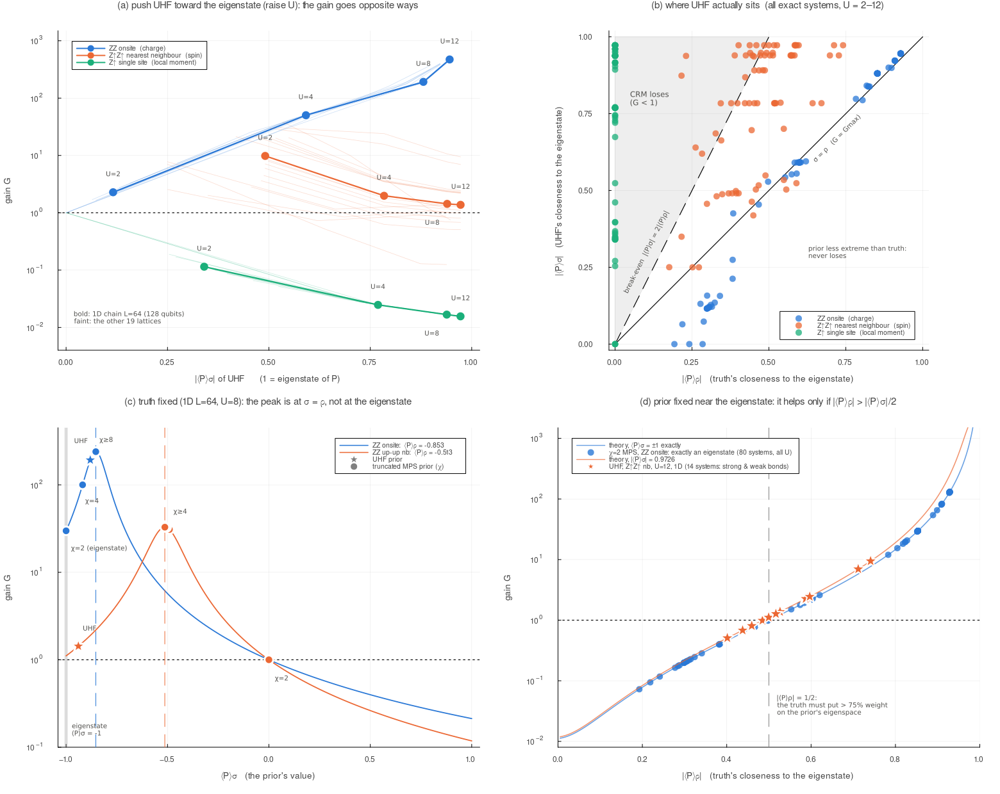
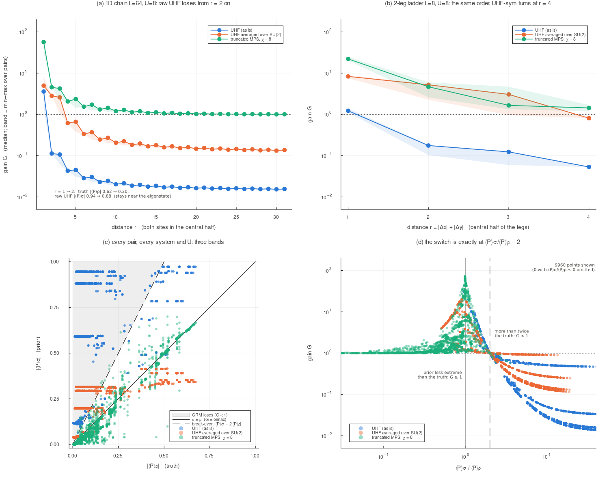

# 仮説の検証: prior が観測量の固有状態に近いほど、利得は大きいか

[README.md](README.md) に戻る / 利得の式の導出: [README_prior_survey.md](README_prior_survey.md) の「利得はどう求めたか」 / 利得法則の実測検証: [README_gainlaw.md](README_gainlaw.md)

図: [crm_new_fig_eigen.png](crm_new_fig_eigen.png) / 図のスクリプト: [crm_eigen_figure.jl](crm_eigen_figure.jl) / 集計: [crm_eigen_hypothesis.py](crm_eigen_hypothesis.py)

---

## この文書の要点

検証した仮説は「**HF(UHF)基底状態が観測量の固有状態に近いほど、CRM の利得 $G$ が大きくなる**」である。

1. **仮説はそのままの形では成り立たない。** オンサイト ZZ(電荷の量)では成り立つが、隣接サイトのスピン相関では**逆向き**になり、単一サイトの $Z_\uparrow$ では**最も極端に逆転**して、UHF を prior にすると標準シャドウより **64倍悪く**なる。HF の解どうしで比べても、隣接スピン相関では**磁化を持たない RHF(固有状態から遠い)が最良で、固有状態に最も近い UHF が最悪**である(3.6)。
2. **利得を決めるのは「 $\sigma$ が固有状態にどれだけ近いか」ではなく「 $\sigma$ が $\rho$ と同じだけ固有状態に近いか」である。** 仮説のうち正しいのは**真の状態 $\rho$ の側**で、 $\rho$ が固有状態に近いほど利得の天井 $G_{\max}$ は高くなる(固有状態からの離れ具合に反比例する、1.6)。 $\rho$ を固定すると、 $G$ は $\langle P\rangle_\sigma=\langle P\rangle_\rho$ で最大になり、固有状態では最大にならない。これは式から厳密に言える。
3. **損得の境目は厳密に書ける**: CRM が標準シャドウに勝つのは $0<\langle P\rangle_\sigma/\langle P\rangle_\rho<2$ のときだけである。とくに**固有状態そのものの prior が得をするのは、真の状態がその固有空間に 75% 以上の重みを持つとき( $\lvert\langle P\rangle_\rho\rvert>1/2$ )だけ**である。 $n_m$ にも台の大きさにも依らない。
4. **実際の prior は真の状態より固有状態に寄りすぎる(過信する)ことが多い。** UHF はスピンの量で 92.5%、 $\chi_p\le4$ の MPS はオンサイト ZZ で 99.4% がそうである。
5. **UHF が寄りすぎる理由は対称性の破れである。** UHF は「各サイトに局所モーメントができる」ことと「それが秩序を持つ」ことを同じ1つの磁化 $m$ で表す。前者は本物なので電荷の量では正しく、後者は有限系や1次元では起こらないのでスピンの量では過信になる。
6. **強結合の極限では、隣接スピン相関で UHF が得をする条件は $\lvert\langle\mathbf S_i\cdot\mathbf S_j\rangle\rvert>3/8$ になる。** 1次元(0.446)は満たし、2次元正方格子(0.351)は満たさない。**2次元の強結合では UHF prior は隣接スピン相関で損をする**と予想される。手元の厳密データでは、全ての格子で損得がその結合の一重項の強さで決まっていた。
7. **対策は既にある: §2j の SU(2) 群平均(UHF-sym)である。** 群平均は相関を3成分に配り直すので、隣接スピン相関の prior の値が $\lvert y\rvert\to1$ から $1/3$ に下がり、過信が控えめに変わる。**損をする系は 80 系中 17 から 0 になる。** ただし真の相関が強い結合では値が低すぎて、かえって利得が下がることもある(3.5)。
8. **距離 $r$ の相関で、 $\rho$ だけを固有状態から遠ざけると、規則がそのまま現れる(4)。** UHF は長距離秩序のせいで遠くの対でも $\lvert y\rvert\approx0.88$ のまま残り、真の相関は減衰するので、**1次元では $r=2$ から全ての対で損をする**( $G\approx0.02$ )。UHF-sym も予想どおり $\lvert x\rvert<1/6$ となる $r=4$ から損に転じる。20 系・16600 点で、損得は prior の種類・次元・距離・ $U$ に関係なく「prior の値が真の値の2倍を超えるか」だけで決まっていた。



---

## 1. 仮説を式にする

### 1.1 「固有状態に近い」を数で表す

観測量はパウリ文字列 $P$ とする(固有値は $+1$ と $-1$ の2つだけ)。**固有状態**とは、 $P$ を測ったとき結果が必ず同じになる状態のことである。一般の状態 $\tau$ で $P$ を測ると $+1$ が確率 $p_+$ 、 $-1$ が確率 $p_-$ で出て、

```math
\langle P\rangle_\tau=p_+-p_-,\qquad p_++p_-=1
```

である。そこで「固有状態からの離れ具合」を、**少数派の結果が出る確率**で測る:

```math
\eta_\tau\equiv\min(p_+,p_-)=\frac{1-\lvert\langle P\rangle_\tau\rvert}{2}
```

| $\eta$ | 意味 | $\lvert\langle P\rangle\rvert$ |
|---|---|---|
| $0$ | 固有状態(結果が必ず同じ) | $1$ |
| $1/4$ | 多数派の結果が 75% | $1/2$ |
| $1/2$ | 両方の結果が半々(固有状態から最も遠い) | $0$ |

**$\lvert\langle P\rangle\rvert$ が 1 に近いほど固有状態に近い**、と読み替えてよい。以下 $x=\langle P\rangle_\rho$ (真の状態)、 $y=\langle P\rangle_\sigma$ (prior)と書く。

### 1.2 利得は $\langle P\rangle_\sigma$ を通してしか prior に依存しない

単一パウリ文字列の利得は( $K=3^{\lvert A\rvert}-1$ 、 $\Delta=x-y$ )

```math
G=\frac{Kx^2+v_s}{K\Delta^2+v_s},\qquad v_s=\frac{3^{\lvert A\rvert}(1-x^2)}{n_m}
```

である(導出は [README_prior_survey.md](README_prior_survey.md))。**prior $\sigma$ は $y$ の1つの数としてしか入っていない。** したがって「 $\sigma$ が固有状態に近い」ことが効くとしたら、それは $y$ を通してだけであり、その効き方は $\Delta=x-y$ で決まる。

### 1.3 同符号なら $\lvert\Delta\rvert$ は「近さの差」になる

$x$ と $y$ が同じ符号 $s=\pm1$ を持つとき、 $x=s(1-2\eta_\rho)$ 、 $y=s(1-2\eta_\sigma)$ と書けるので

```math
\lvert\Delta\rvert=\lvert x-y\rvert=2\,\lvert\eta_\sigma-\eta_\rho\rvert
```

が恒等的に成り立つ。**$G$ は $\lvert\Delta\rvert$ の減少関数なので、 $\rho$ を固定したとき $G$ が最大になるのは $\eta_\sigma=\eta_\rho$ 、つまり prior が真の状態と同じだけ固有状態に近いときである。** $\eta_\sigma=0$ (固有状態)ではない。

ここから仮説の成否が2つに分かれる:

| prior の位置 | 名前 | $\sigma$ を固有状態に近づけると |
|---|---|---|
| $\eta_\sigma>\eta_\rho$ (真の状態より固有状態から遠い) | **控えめ** | $\lvert\Delta\rvert$ が縮み、**$G$ は増える(仮説どおり)** |
| $\eta_\sigma<\eta_\rho$ (真の状態より固有状態に近い) | **過信** | $\lvert\Delta\rvert$ が広がり、**$G$ は減る(仮説と逆)** |

「過信」は、prior が真の値より極端な値( $\pm1$ に近い値)を予測している状態である。

### 1.4 損得の境目: $0<y/x<2$

CRM が標準シャドウに勝つ( $G>1$ )条件は、式から直接

```math
G>1\iff Kx^2>K\Delta^2\iff\lvert x-y\rvert<\lvert x\rvert\iff 0<\frac{y}{x}<2
```

である。 $v_s$ が両辺から消えるので、**$n_m$ にも台の大きさ $\lvert A\rvert$ にも依らない。** 読み替えると:

- **同符号で控えめ**( $0<y/x\le1$ ): 必ず $G\ge1$ 。控えめな prior は決して損をしない
- **同符号で過信**( $1<y/x$ ): **prior の値が真の値の2倍未満**なら得、2倍を超えると損
- **逆符号**( $y/x<0$ ): 必ず $G\le1$
- **$y=0$**: ちょうど $G=1$ (prior が何も言っていないので CRM は標準シャドウと同じ)

### 1.5 固有状態そのものの prior: 真の状態が 75% 以上その固有空間にいるときだけ得をする

$\lvert y\rvert=1$ (正しい符号の固有状態)を 1.4 に入れると、 $\lvert\Delta\rvert=1-\lvert x\rvert$ なので

```math
G>1\iff\lvert x\rvert>\frac12\iff\eta_\rho<\frac14
```

である。**真の状態が prior の固有空間に 75% 以上の重みを持たない限り、固有状態の prior は標準シャドウより悪い。** 1.4 と同じく $n_m$ と $\lvert A\rvert$ に依らない。

### 1.6 仮説の正しい部分: 固有状態への近さは $\rho$ の天井を決める

$\rho$ 側の固有状態への近さには、はっきりした役割がある。**真の状態が固有状態に近いほど、利得の天井(prior が完全なときの利得)が高くなる。** 以下、その理由を式から順に示す。要点は、分散が「prior で消せる部分」と「どんな prior でも消せない部分」に分かれ、**消せない部分が $\rho$ の固有状態でちょうど 0 になる**ことである。

**ステップ1: 天井とは何か。** 1.2 の利得の式

```math
G=\frac{Kx^2+v_s}{K\Delta^2+v_s},\qquad K=3^{\lvert A\rvert}-1,\qquad v_s=\frac{3^{\lvert A\rvert}(1-x^2)}{n_m}
```

で、**分子は prior に依らない**。分母は $K\Delta^2\ge0$ なので必ず $v_s$ 以上で、等号は $\Delta=0$ (prior の値が真の値に一致する)のときだけである。したがって

```math
G\le G_{\max}=\frac{Kx^2+v_s}{v_s}=1+\frac{Kx^2}{v_s}
```

が成り立つ。これが天井で、 **$x$ だけで決まり、prior には依らない**。

**ステップ2: 分散を「くじ」と「ショット」に分ける。** 1ユニットの推定量は $\hat o=3^{\lvert A\rvert}h\,m$ だった( $h$ は基底が当たれば 1、外れれば 0。 $m$ は $n_m$ ショットの平均。定義は [README_prior_survey.md](README_prior_survey.md) の「利得はどう求めたか」のステップ1)。ここで**全分散の法則**を使う。「全体のばらつき = グループごとの平均値のばらつき + グループ内のばらつきの平均」で、グループは「当たり」と「外れ」である:

```math
\mathrm{Var}(\hat o)=\underbrace{\mathrm{Var}\bigl(\mathbb E[\hat o\mid h]\bigr)}_{(\mathrm a)}+\underbrace{\mathbb E\bigl[\mathrm{Var}(\hat o\mid h)\bigr]}_{(\mathrm b)}
```

(a) **くじのばらつき**: 当たりなら平均 $3^{\lvert A\rvert}x$ 、外れなら 0 である。 $h$ は確率 $p=3^{-\lvert A\rvert}$ で 1 になるので $\mathrm{Var}(h)=p(1-p)$ で、

```math
\mathrm{Var}\bigl(3^{\lvert A\rvert}h\,x\bigr)=3^{2\lvert A\rvert}x^2\cdot3^{-\lvert A\rvert}\bigl(1-3^{-\lvert A\rvert}\bigr)=Kx^2
```

(b) **ショットのばらつき**: 当たりのときだけ $m$ が揺れ、その分散は $3^{2\lvert A\rvert}\mathrm{Var}(m)$ 、外れでは 0 である。平均すると

```math
p\cdot3^{2\lvert A\rvert}\cdot\frac{1-x^2}{n_m}=\frac{3^{\lvert A\rvert}(1-x^2)}{n_m}=v_s
```

CRM の推定量 $3^{\lvert A\rvert}h(m-s)+s$ で同じ計算をすると、(a) では $x$ が $\Delta$ に置き換わる。一方で定数 $s$ を引いても $m$ の揺れは変わらないので、(b) はそのまま残る:

| | (a) くじのばらつき | (b) ショットのばらつき |
|---|---|---|
| 標準シャドウ | $Kx^2$ | $v_s$ |
| CRM | $K\Delta^2$ | $v_s$ (**同じ**) |

**prior が消せるのは (a) だけで、(b) は床として必ず残る。** だから天井は「標準シャドウの分散全体 ÷ 床」になる。乱数で分解を確かめると( $\lvert A\rvert=2$ 、 $n_m=100$ 、各 $2\times10^6$ ユニット)、 $x=0.5$ で (a) 1.9983 + (b) 0.06770(理論 2.0000 + 0.06750)、 $x=0.9$ で (a) 6.4901 + (b) 0.01712(理論 6.4800 + 0.01710)だった。

**ステップ3: 床の正体は、 $\rho$ で $P$ を測ったときの量子的なばらつき。** 1ショットの結果 $s=\pm1$ は、 $+1$ が確率 $p_+=(1+x)/2$ 、 $-1$ が確率 $p_-$ で出る。 $s^2=1$ なので

```math
\mathrm{Var}(s)=\mathbb E[s^2]-\mathbb E[s]^2=1-x^2=4p_+p_-=4\eta_\rho(1-\eta_\rho)
```

である。これは **$p_+$ か $p_-$ が 0 のとき、つまり $\rho$ が $P$ の固有状態のときにだけ 0 になる**。結果が毎回同じなら、ショットのばらつきは原理的に存在しないからである。

**ステップ4: 天井を固有状態への近さで書く。** ステップ3をステップ1に入れると

```math
G_{\max}=1+\frac{K\,n_m}{3^{\lvert A\rvert}}\cdot\frac{x^2}{1-x^2}=1+\frac{K\,n_m}{3^{\lvert A\rvert}}\cdot\frac{(1-2\eta_\rho)^2}{4\eta_\rho(1-\eta_\rho)}
```

となる(統合表の 1580 行で相対差 $1.5\times10^{-7}$ 以内)。 $x^2/(1-x^2)$ を $x^2$ で微分すると $1/(1-x^2)^2>0$ なので、 **$\lvert x\rvert$ が 1 に近づく(固有状態に近づく)ほど $G_{\max}$ は単調に増える**。しかも2つの効果が同じ向きに働く:

- 分子(消せる部分 $Kx^2$ )は $x^2\to1$ で**増える**
- 分母(床 $\propto1-x^2$ )は **0 に向かう**

固有状態の近く( $\eta_\rho\ll1$ )では

```math
G_{\max}\approx\frac{K\,n_m}{4\cdot3^{\lvert A\rvert}\,\eta_\rho}
```

となり、**天井は $\rho$ の固有状態からの離れ具合に反比例する**。

**ステップ5: 数値で見る**( $\lvert A\rvert=2$ 、 $n_m=100$ ):

| $\lvert x\rvert$ | $\eta_\rho$ | (a) くじ $Kx^2$ | (b) 床 $v_s$ | $G_{\max}$ | 近似 $Kn_m/(4\cdot3^{\lvert A\rvert}\eta_\rho)$ |
|---|---|---|---|---|---|
| 0 | 0.5 | 0 | 0.0900 | **1.0** | — |
| 0.5 | 0.25 | 2.00 | 0.0675 | 30.6 | 88.9 |
| 0.9 | 0.05 | 6.48 | 0.0171 | 380 | 444 |
| 0.99 | 0.005 | 7.84 | 0.00179 | 4379 | 4444 |
| 0.999 | 0.0005 | 7.98 | 0.00018 | 44379 | 44444 |

(a) は最大でも $K=8$ までしか増えないが、(b) は 0 に向かって桁で縮む。**天井を押し上げているのは主に床の消滅である。** $x=0$ では消せる部分がそもそも 0 なので、どんな prior でも $G=1$ を超えられない(2.6 の単一サイト $Z_\uparrow$ がこれに当たる)。近似式のずれは $\eta_\rho=0.05$ で 17%、 $0.01$ で 3.0%、 $0.005$ で 1.5% である。実データでは、1次元 $L=64$ のオンサイト ZZ で $U=2\to12$ のとき $\eta_\rho$ が 0.351 から 0.036 に下がり、 $G_{\max}$ は 9.7 から 559 に上がる(近似式では 624)。

**ステップ6: ちょうど固有状態のとき天井が無限大になる意味。** $x=\pm1$ ならショットは毎回同じ結果で、 $m=x$ が厳密に成り立つ。完全な prior( $s=x$ )を使うと

```math
\hat o_{\rm CRM}=3^{\lvert A\rvert}h\,(x-x)+x=x
```

が当たり外れに関係なく**全てのユニットで**成り立ち、推定量の分散はちょうど 0 になる。標準シャドウには (a) の $K$ が残るので、比は無限大である。式の見かけ上の発散ではなく、**実際に誤差なしで推定できる状況**に対応している。

**注意。** これは単一パウリ文字列についての厳密な結果である。 $G_{\max}-1$ は $n_m$ に比例する(ショットを増やすと床だけが下がるため)。天井は $\rho$ ・ $P$ ・ $n_m$ ・ $\lvert A\rvert$ だけで決まり、**実際にそこへ届くかどうかは prior の $\Delta$ で決まる**。

したがって仮説を正しく言い直すと次のようになる:

> **真の状態 $\rho$ が固有状態に近いほど、利得の天井は高い。prior がその天井に届くのは、 $\rho$ と同じだけ固有状態に近いときである。**

「prior が固有状態に近いほど」ではなく「 $\rho$ が近いほど」、そして「prior が $\rho$ に合っているほど」である。

### 1.7 数値で確かめる

上の恒等式を $10^6$ 個の乱数 $(x,y,\lvert A\rvert,n_m)$ で確かめた([crm_eigen_hypothesis.py](crm_eigen_hypothesis.py) の [7]。1.6 の分解の確認も同じ場所にある)。

| 恒等式 | 破れた点 |
|---|---|
| 同符号で $\lvert\Delta\rvert=2\lvert\eta_\sigma-\eta_\rho\rvert$ | 0(最大誤差 0.0) |
| $G>1\iff0<y/x<2$ ( $\lvert A\rvert=1$ 〜 $5$ 、 $n_m=1$ 〜 $10^4$ ) | 0 / $10^6$ |
| $\lvert y\rvert=1$ で $G>1\iff\lvert x\rvert>1/2$ | 0 / $10^6$ |
| $\rho$ 固定で $G$ を最大にする $y$ と $x$ のずれ | $2.2\times10^{-16}$ |

---

## 2. 既存データで検証する

厳密な $\rho$ を持つ系の単一パウリ行 **1436行**(オンサイト ZZ と隣接 $Z_\uparrow Z_\uparrow$ 、各 718 行)を使う([crm_edfid_all.tsv](crm_edfid_all.tsv))。まず 1.4 の恒等式 $G>1\iff0<y/x<2$ を全行で照合し、**破れは 0 行**だった。

これに加えて、**単一サイトの $Z_\uparrow$** を同じ表から組み立てた。 $Z_\uparrow=1-2n_\uparrow$ と $n_\uparrow=(n+2S^z)/2$ から $\langle Z_\uparrow\rangle=1-\langle n\rangle-2\langle S^z\rangle$ で、統合表の $n$ と $S^z$ の行から $\rho$ と各 prior の値が出る(台は1量子ビット)。

### 2.1 仮説そのもの: $U$ を上げて UHF を固有状態に近づける

$U$ を上げると UHF の磁化 $m$ が育ち、どの観測量でも UHF は固有状態に近づく。そのとき利得がどう動くかを、1次元 $L=64$ (128量子ビット)の UHF で見る:

| $U$ | オンサイト ZZ: $\lvert y\rvert$ | $G$ | 隣接 $Z_\uparrow Z_\uparrow$ : $\lvert y\rvert$ | $G$ | 単一サイト $Z_\uparrow$ : $\lvert y\rvert$ | $G$ |
|---|---|---|---|---|---|---|
| 2 | 0.116 | 2.28 | 0.491 | 9.81 | 0.340 | 0.115 |
| 4 | 0.591 | 50.3 | 0.784 | 1.98 | 0.769 | 0.025 |
| 8 | 0.881 | 192.1 | 0.940 | 1.43 | 0.939 | 0.017 |
| 12 | 0.946 | 472.3 | 0.973 | 1.38 | 0.972 | **0.016** |

**同じ「UHF が固有状態に近づく」という変化で、利得は電荷の量で 207倍に増え、スピンの量で 7分の1 に減り、局所スピンでは標準シャドウの 64分の1 まで落ちる。**

格子を固定して $U$ を振った全20格子で数えると:

| 観測量 | 仮説どおり( $\lvert y\rvert$ が大きい $U$ ほど $G$ が大きい) | 逆向き | 混在 |
|---|---|---|---|
| オンサイト ZZ | **20** | 0 | 0 |
| 隣接 $Z_\uparrow Z_\uparrow$ | 0 | **17** | 3 |

図 (a) の太線が $L=64$ 、細線が残りの19格子である。

### 2.2 仮説が「成り立つ」オンサイト ZZ でも、効いているのは $\rho$ の側である

オンサイト ZZ で $G$ が増えるのは、UHF が固有状態に近づくからではない。**真の状態 $\rho$ 自身が固有状態に近づき、利得の天井 $G_{\max}=G(\Delta=0)$ が上がるから**である。 $G_{\max}$ は $x$ だけで決まるので、 $\log G$ の変化を「天井」と「天井に対する到達度 $G/G_{\max}$ 」に分けられる( $L=64$ 、UHF):

| $U$ | $G$ | $G_{\max}$ (ρだけで決まる) | $G/G_{\max}$ (prior の到達度) | $\Delta\log G$ = 天井 + 到達度 |
|---|---|---|---|---|
| 2 | 2.28 | 9.68 | 0.236 | |
| 4 | 50.3 | 50.7 | 0.992 | $+3.09=+1.66+1.44$ |
| 8 | 192.1 | 239.3 | 0.803 | $+1.34=+1.55-0.21$ |
| 12 | 472.3 | 559.0 | 0.845 | $+0.90=+0.85+0.05$ |

$U=2\to12$ の増加のうち**天井の寄与は 76%** である(他の格子でも 74〜79%)。そして $U=4\to8$ では、UHF が固有状態に近づいたことで**到達度はむしろ下がっている**( $-0.21$ )。 $U=4$ で UHF は $\rho$ とほぼ同じ位置(控えめ側、 $\eta_\sigma=0.2043$ 対 $\eta_\rho=0.2005$ )にいて、 $U\ge8$ で追い越して過信側に出るからである。**オンサイト ZZ の中でも、prior の寄与は 1.3 の規則どおりに動いている。**

### 2.3 $\rho$ を固定して prior を取り替える: 最も固有状態に近い prior が最良なのは 160系中1系

$\rho$ を固定すれば天井は共通なので、prior の効果だけが見える。1次元 $L=64$ 、 $U=8$ で各 prior を並べると(図 (c)):

| prior | オンサイト ZZ: $y$ | $G$ | 隣接 $Z_\uparrow Z_\uparrow$ : $y$ | $G$ |
|---|---|---|---|---|
| (真の値 $x$ ) | $-0.8534$ | | $-0.5133$ | |
| $\chi_p=2$ | **$-1.0000$ (固有状態)** | **29.8** | $0.0000$ | 1.00 |
| $\chi_p=4$ | $-0.9187$ | 100.0 | $-0.4905$ | 30.9 |
| UHF | $-0.8808$ | 192.1 | **$-0.9395$** | **1.43** |
| $\chi_p=8$ | $-0.8575$ | 238.0 | $-0.5048$ | 32.5 |
| $\chi_p\ge16$ | $-0.8534$ | 239.3 | $-0.5133$ | 32.8 |

**オンサイト ZZ では、固有状態に近い prior ほど利得が単調に低い。** ちょうど固有状態の $\chi_p=2$ は $G=29.8$ で、真の値に一致する $\chi_p\ge16$ の8分の1しかない。隣接 $Z_\uparrow Z_\uparrow$ で最も固有状態に近いのは UHF で、 $G=1.43$ と全 prior 中で最悪( $y=0$ の $\chi_p=2$ を除く)である。

全系で数えると:

| 観測量 | 系の数 | 最も固有状態に近い prior が最良 | 系ごとの Spearman( $\eta_\sigma$ , $G$ ) 中央値 [10%, 90%] |
|---|---|---|---|
| オンサイト ZZ | 80 | **0** | $+0.97$ [ $+0.52$ , $+1.00$ ] |
| 隣接 $Z_\uparrow Z_\uparrow$ | 80 | **1** | $-0.37$ [ $-0.64$ , $+0.32$ ] |

仮説どおりなら Spearman は $-1$ に近いはずである。**オンサイト ZZ ではほぼ $+1$ で完全に逆**、隣接相関では系によって符号すら定まらない。一方、1.3 の変数 $\lvert\eta_\sigma-\eta_\rho\rvert$ に取り替えると、距離の異なる 5697 組の prior 対のうち**順序が逆になる組は 0** だった(Spearman が厳密に $-1$ にならない系があるのは、 $\lvert\Delta\rvert\sim10^{-10}$ で $K\Delta^2$ が倍精度で $v_s$ に埋もれ、 $G$ が同値になる 20 組のためである)。

### 2.4 prior を固定して $\rho$ を取り替える: 閾値 $1/2$ がデータに現れる

**ちょうど固有状態の prior が手元にある。** $\chi_p=2$ の MPS は、厳密な全 80 系・全 $U$ でオンサイト ZZ が**厳密に $-1$** である(電荷のゆらぎを完全に落としている)。一方で $\lvert x\rvert$ は $U=2$ の 0.19 から $U=12$ の 0.93 まで動くので、1.5 の閾値を直接試せる(図 (d) 青):

| | 行数 | 勝ち( $G>1$ ) | 負け | 勝ちの $\lvert x\rvert$ 最小値 | 負けの $\lvert x\rvert$ 最大値 |
|---|---|---|---|---|---|
| ほぼ固有状態の prior( $\eta_\sigma<0.02$ ) | 141 | 108 | 33 | **0.4994** | **0.4974** |

**勝ちと負けは $\lvert x\rvert=1/2$ でちょうど分かれる。** 80 系の $\chi_p=2$ の点はすべて理論曲線 $G(x,\,y=\pm1)$ の上に乗る。

**UHF を固定して結合だけを取り替える自然実験**もある。開放端の1次元鎖では中央の結合が $L$ によって強い結合(一重項が強い)と弱い結合に交互に入れ替わるが、UHF の値はどの $L$ でも同じ( $U=12$ で $y=-0.9726$ 、 $\eta_\sigma=0.0137$ )である(図 (d) 橙):

| $L$ | 中央の結合 | $\eta_\rho$ | $\lvert x\rvert$ | $G$ |
|---|---|---|---|---|
| 10 | 強 | 0.129 | 0.741 | **9.45** |
| 14 | 強 | 0.144 | 0.712 | **6.96** |
| 8 | 弱 | 0.299 | 0.401 | 0.51 |
| 12 | 弱 | 0.281 | 0.438 | 0.68 |
| 16 | 弱 | 0.270 | 0.459 | 0.81 |
| 24 | 弱 | 0.258 | 0.485 | 0.99 |
| 32 | 弱 | 0.250 | 0.499 | 1.11 |
| 48 | 弱 | 0.242 | 0.517 | 1.27 |
| 64 | 弱 | 0.237 | 0.526 | 1.38 |

**prior の固有状態への近さはまったく同じなのに、利得は 0.51 から 9.45 まで 19倍変わる。** 変わったのは $\rho$ の側だけで、境目は $\lvert x\rvert=\lvert y\rvert/2=0.486$ ( $L=24$ と $32$ の間)にある。

### 2.5 実際の prior はどちら側にいるか

1.3 の分類で全行を数えると:

| 観測量 | prior | 過信 | 控えめ | ほぼ一致( $\lvert\eta_\sigma-\eta_\rho\rvert<10^{-6}$ ) | 逆符号 | $y=0$ |
|---|---|---|---|---|---|---|
| オンサイト ZZ | UHF | 52.5% | 43.8% | 0% | 0% | 3.8% |
| オンサイト ZZ | $\chi_p\le4$ | **99.4%** | 0% | 0% | 0.6% | 0% |
| オンサイト ZZ | $\chi_p\ge8$ | 71.8% | 1.0% | 27.2% | 0% | 0% |
| 隣接 $Z_\uparrow Z_\uparrow$ | UHF | **92.5%** | 7.5% | 0% | 0% | 0% |
| 隣接 $Z_\uparrow Z_\uparrow$ | $\chi_p\le4$ | 24.4% | 26.2% | 0% | 0% | **49.4%** |
| 隣接 $Z_\uparrow Z_\uparrow$ | $\chi_p\ge8$ | 8.4% | 70.5% | 20.9% | 0.2% | 0% |

図 (b) は UHF の全点を $(\lvert x\rvert,\lvert y\rvert)$ 平面に置いたものである。対角線が $\sigma=\rho$ 、破線 $\lvert y\rvert=2\lvert x\rvert$ が損益分岐、灰色が損をする領域である。**オンサイト ZZ(青)は対角線の近くに、隣接相関(橙)は対角線の上に大きく外れて多くが灰色に入り、単一サイト $Z_\uparrow$ (緑)は $\lvert x\rvert=0$ の縦軸上に並んで全点が灰色に入る。**

UHF の過信は $U$ に依存し、オンサイト ZZ では $U\le4$ で控えめ、 $U\ge8$ で過信になる。 $\chi_p\le4$ の MPS はオンサイト ZZ をほぼ必ず過信する一方、隣接相関は半数で $y=0$ ちょうど( $G=1$ )になる。これは 3.4 で扱う。

### 2.6 単一サイト $Z_\uparrow$ : 最も極端な逆転

**単一サイト $Z_\uparrow$ では、真の状態はつねに固有状態から最も遠い。** 厳密な基底状態はスピン反転対称(全スピン一重項)なので $\langle S^z_i\rangle=0$ 、半充填なので $\langle n_i\rangle=1$ 、したがって $x=\langle Z_\uparrow\rangle_\rho=0$ ( $\eta_\rho=1/2$ )である。1.4 より $y\neq0$ の prior は必ず損をする。

UHF の値は $y=-2m$ (副格子で符号が交代)で、**UHF の固有状態への近さは磁化そのもの**である:

| $U$ | 真の $\langle S^z\rangle$ | UHF の $\langle S^z\rangle=m$ | UHF の $y$ | $\eta_\sigma$ | $G$ |
|---|---|---|---|---|---|
| 2 | 0 | 0.170 | $-0.340$ | 0.330 | 0.115 |
| 4 | 0 | 0.385 | $-0.769$ | 0.116 | 0.025 |
| 8 | 0 | 0.469 | $-0.939$ | 0.031 | 0.017 |
| 12 | 0 | 0.486 | $-0.972$ | 0.014 | **0.0156** |

全厳密系で UHF は **80系中77系で損**をし(残り3系は UHF が非磁性解に落ちて $y=0$ 、 $G=1$ ちょうど)、最悪は $G=0.0156$ である。

MPS prior はスピン反転対称を保つので $\langle S^z\rangle_\sigma=0$ で、ほぼ全系で $G=1$ だった。**例外はフラストレートした 4×3 トーラス(奇環を持つ非二部格子)だけ**で、そこでは $\chi_p=4$ で $G=0.033$ まで落ちる。ただし原因はスピンではなく**電荷**で、切断した MPS が並進対称性を破って中央サイトの密度が $\langle n\rangle_\sigma=1.66$ まで偏るためである( $\langle S^z\rangle_\sigma=0$ のまま)。**「真の状態の対称性が $x=0$ を強制する量では、その対称性を破った prior は必ず損をする」**という同じ原理が、別の対称性で現れている。

---

## 3. 考察: なぜ UHF はスピンの量で固有状態に寄りすぎるのか

### 3.1 UHF の期待値は磁化で決まる

UHF はスピン上向きと下向きを混ぜない1枚の Slater 行列式なので、同じサイトの上向きと下向きの占有に相関がない。したがって

```math
\langle Z_{i\uparrow}Z_{i\downarrow}\rangle_{\rm UHF}=\langle Z_{i\uparrow}\rangle\langle Z_{i\downarrow}\rangle=(1-2n_{i\uparrow})(1-2n_{i\downarrow})
```

が厳密に成り立つ(全 UHF 行で最大差 $1.1\times10^{-8}$ )。局所密度が1なら $n_{i\uparrow}=\tfrac12+m_i$ 、 $n_{i\downarrow}=\tfrac12-m_i$ なので

```math
\langle Z_{i\uparrow}\rangle_{\rm UHF}=-2m_i,\qquad
\langle Z_{i\uparrow}Z_{i\downarrow}\rangle_{\rm UHF}\approx-4m_i^2,\qquad
\langle Z_{i\uparrow}Z_{j\uparrow}\rangle_{\rm UHF}=4m_im_j-4\lvert\langle c^\dagger_{i\uparrow}c_{j\uparrow}\rangle\rvert^2
```

となる(最後は Wick の定理)。隣接サイトは副格子が違うので $m_j=-m_i$ で、 $-4m^2-4\lvert\langle c^\dagger_{i\uparrow}c_{j\uparrow}\rangle\rvert^2$ である。 $U$ が大きいと $m\to1/2$ 、ホッピング項 $\to0$ なので、**3つの観測量すべてが同じ1つの数 $m$ に引っ張られて固有状態( $\lvert y\rvert\to1$ )に向かう。**

### 3.2 真の状態では「局所モーメント」と「秩序」は別物である

真の状態で同じ3つを見ると、振る舞いが分かれる:

| 観測量 | 真の状態での値 | 強結合で固有状態に近づくか | UHF は |
|---|---|---|---|
| オンサイト ZZ | $-1+4d$ ( $d$ は二重占有) | **近づく**: $U$ が大きいと $d\to0$ で、各サイトに電子が1個ずつ局在する(局所モーメントの形成) | 正しく追従する |
| 単一サイト $Z_\uparrow$ | $0$ (スピン反転対称) | **近づかない**: 対称性で $0$ に固定 | 磁化を持つので過信 |
| 隣接 $Z_\uparrow Z_\uparrow$ | $\approx4\langle S^z_iS^z_j\rangle$ ( $U\to\infty$ ) | **途中まで**: 量子ゆらぎで $\lvert x\rvert\approx0.5$ 前後に留まる | 過信 |

**局所モーメントができること(電荷の局在)は本物の物理なので、オンサイト ZZ で UHF が固有状態に近づくのは正しい。** しかしモーメントが**そろうこと**(反強磁性秩序)は、有限系や1次元の真の基底状態では起こらない。**UHF は両方を同じ $m$ で表すので、前者で正しく、後者で過信になる。**

### 3.3 強結合極限での判定: $\lvert\langle\mathbf S_i\cdot\mathbf S_j\rangle\rvert>3/8$

隣接 $Z_\uparrow Z_\uparrow$ の損得は、 $U\to\infty$ で1つの物理量に帰着する。1サイト1電子なら $Z_{i\uparrow}=-2S^z_i$ なので $x=4\langle S^z_iS^z_j\rangle$ である。真の状態はスピン回転対称なので、相関は $x,y,z$ の3成分に等分されて

```math
\langle S^z_iS^z_j\rangle_\rho=\tfrac13\langle\mathbf S_i\cdot\mathbf S_j\rangle_\rho
\quad\Longrightarrow\quad
\lvert x\rvert=\tfrac43\,\lvert\langle\mathbf S_i\cdot\mathbf S_j\rangle_\rho\rvert
```

一方 UHF は $z$ 方向にそろった秩序なので、**相関をすべて $z$ 成分に置き**、 $\lvert y\rvert\to1$ である。1.5 の閾値 $\lvert x\rvert>1/2$ に入れると

```math
G>1\iff\lvert\langle\mathbf S_i\cdot\mathbf S_j\rangle_\rho\rvert>\frac38
```

になる。**UHF の過信の根は「3成分に分かれている相関を1成分に集めている」ことにある。** 古典的なネール状態( $\lvert\mathbf S_i\cdot\mathbf S_j\rvert=1/4$ )に近いほどこの3倍の食い違いがそのまま出て損をし、一重項( $3/4$ )に近いほど量子ゆらぎが食い違いを埋めて得をする。

ハイゼンベルク模型の厳密対角化(16スピン)で閾値と比べると:

| 格子 | 配位数 | $E_0$ | $\lvert\langle\mathbf S_i\cdot\mathbf S_j\rangle\rvert$ | $\lvert x\rvert=4\lvert\langle S^zS^z\rangle\rvert$ | 判定 |
|---|---|---|---|---|---|
| 1次元環 $L=16$ | 2 | $-7.142296$ | 0.446 | 0.595 | **得** |
| 2次元 4×4 トーラス | 4 | $-11.228483$ | 0.351 | 0.468 | **損** |
| (熱力学極限: 1次元, Bethe 仮説) | 2 | | $\ln2-1/4=0.443$ | 0.591 | 得 |
| (熱力学極限: 2次元正方格子, QMC) | 4 | | 0.335 | 0.446 | 損 |

熱力学極限の値は文献値(1次元は Hulthén の厳密解、2次元は量子モンテカルロの $E_0/N=-0.669437$ )で、16スピンの対角化はそれと整合する。

手元の Hubbard 厳密データ( $U=12$ 、UHF)で確かめる。UHF の $\lvert y\rvert$ は 0.94〜0.97 で1より少し小さいので、閾値は $\lvert x\rvert>\lvert y\rvert/2$ 、つまり $\tfrac34\lvert x\rvert>\tfrac38\lvert y\rvert\approx0.35$ 〜 $0.36$ である:

| 格子 | 境界 | 配位数 | $\lvert x\rvert$ | $\tfrac34\lvert x\rvert$ ( $\approx\lvert\mathbf S\cdot\mathbf S\rvert$ ) | $\tfrac38\lvert y\rvert$ (閾値) | $G$ |
|---|---|---|---|---|---|---|
| 1次元環 $L=8$ 〜 $16$ | 周期 | 2 | 0.584〜0.597 | 0.438〜0.448 | 0.365 | **2.20〜2.45** |
| 2本脚梯子 $L=4,6$ | 周期 | 3 | 0.493〜0.513 | 0.369〜0.384 | 0.355 | **1.16〜1.37** |
| 1次元鎖 $L=64$ (中央は弱い結合) | 開放 | 2 | 0.526 | 0.395 | 0.365 | **1.38** |
| 1次元鎖 $L=8$ (中央は弱い結合) | 開放 | 2 | 0.401 | 0.301 | 0.365 | **0.51** |
| 2本脚梯子 $L=4,6$ | 開放 | 3 | 0.439〜0.474 | 0.329〜0.356 | 0.355 | **0.75〜1.00** |
| 幅4シリンダー $L=3$ | $x$ 開放・ $y$ 周期 | 4 | 0.451 | 0.339 | 0.351 | **0.87** |

**全ての行で、損得は「その結合の一重項の強さ $\tfrac34\lvert x\rvert$ が閾値 $\tfrac38\lvert y\rvert$ を超えるか」で決まっている。** 周期境界どうしで比べると配位数2(2.20〜2.45)> 3(1.16〜1.37)と予想どおりに並ぶ。配位数が増えると1本の結合に分配される一重項が減るからである。

ただし**配位数だけで決まるわけではない。** 開放端の梯子(配位数3)は 0.75〜1.00 で、配位数4のシリンダー(0.87)を下回る。開放端や結合の強弱の交代も一重項の強さを同じくらい動かすからである。配位数4の厳密データは開放端の小さな系1つしかないので、**配位数4の比較は上のハイゼンベルク模型の 4×4 トーラスに頼っている。**

これは「2次元正方格子の強結合 Hubbard 模型では、隣接スピン相関の推定に UHF prior を使うと標準シャドウより悪くなる」という予想を与える。**Hubbard 模型の 4×4 以上では未検証**である(4×4 は厳密な $\rho$ が作れていない)。

### 3.4 低 $\chi$ の MPS は別の偏り方をする

$\chi_p=2$ の MPS はオンサイト ZZ が全 80 系で厳密に $-1$ 、隣接 $Z_\uparrow Z_\uparrow$ がほぼ全系で厳密に $0$ 、単一サイト $Z_\uparrow$ も $0$ だった。つまり**サイト内のゆらぎ(二重占有と空サイト)を捨てて固有状態に寄せ、結合をまたぐ相関も捨てて $0$ に寄せている**。前者は過信(オンサイト ZZ で損をしうる)、後者は $y=0$ で $G=1$ (得も損もしない)になる。UHF が相関を秩序で**置き換える**のに対し、低 $\chi$ の MPS は相関を**捨てる**、という違いである。なぜ中央の結合で相関がちょうど $0$ になるのか(量子数の分解と $\chi=2$ の組み合わせ)は**まだ確かめていない**。ただし $\chi_p=4$ では同じ仕組みがはっきり見えた: 弱結合の開放端の鎖で、MPS が**2サイトの Hubbard 分子の積**になり、分子の内側の相関がちょうど $-1$ 、分子の間がちょうど $0$ になっていた(4.5)。**切断は状態を小さな塊の積に潰し、塊の内側の Z 型相関を固有状態に、外側を 0 に寄せる。**

### 3.5 SU(2) で群平均すると過信は解消する — ただし上限もできる

3.3 の食い違いの根は「3成分に分かれるべき相関を $z$ 成分に集めている」ことだった。これは §2j の**群平均**(prior をスピン回転で平均した混合状態、UHF-sym。詳しい説明は [README_uhfsym.md](README_uhfsym.md))がちょうど取り除くものである。隣接 $Z_\uparrow Z_\uparrow$ を電荷の部分とスピンの部分に分けると( $c_i=1-n_i$ )

```math
Z_{i\uparrow}Z_{j\uparrow}=c_ic_j-2c_iS^z_j-2S^z_ic_j+4S^z_iS^z_j
```

である。スピン回転で平均すると、回転しない $c_ic_j$ はそのまま残り、1つだけスピンを含む交差項は $0$ になり、 $S^z_iS^z_j$ は3成分の平均 $\tfrac13\mathbf S_i\cdot\mathbf S_j$ に置き換わる。したがって群平均した prior の値は、求積なしで厳密に

```math
y_{\rm sym}=\langle c_ic_j\rangle_\sigma+\tfrac43\langle\mathbf S_i\cdot\mathbf S_j\rangle_\sigma
```

である。強結合では $\langle c_ic_j\rangle\to0$ 、UHF の $\langle\mathbf S_i\cdot\mathbf S_j\rangle\to-1/4$ なので **$\lvert y_{\rm sym}\rvert\to1/3$** になる。**過信( $\lvert y\rvert\to1$ )が控えめ( $\lvert y\rvert\to1/3$ )に変わる。** 真の値は1次元で 0.59、2次元で 0.47 なので、どちらでも $y/x<1$ となり、1.4 より損をしない。

**検証の手順。** UHF の自己無撞着計算を Python に移植し([crm_eigen_uhfsym.py](crm_eigen_uhfsym.py))、まず統合表の UHF の値(6観測量 × 80系)を**最大差 $5.5\times10^{-7}$** で再現することを確かめた。そのうえで Wick の定理で $y_{\rm sym}$ を出した。§2i の球面求積の値( $L=8$ 、 $U=4$ で群平均した $\langle S^zS^z\rangle=-0.07331$ )も、上の考え方による $(\langle S^zS^z\rangle+2\langle S^xS^x\rangle)/3=-0.07333$ で再現する(差は §2i に記録された求積格子の誤差の範囲)。

$U=12$ の代表的な系:

| 格子 | $x$ | UHF の $y$ | $y/x$ | $G$ | UHF-sym の $y$ | $y/x$ | $G$ |
|---|---|---|---|---|---|---|---|
| 1次元鎖 $L=64$ (弱い結合) | $-0.526$ | $-0.973$ | 1.85 | 1.38 | $-0.342$ | 0.65 | **6.78** |
| 1次元鎖 $L=10$ (強い結合) | $-0.741$ | $-0.973$ | 1.31 | **9.45** | $-0.342$ | 0.46 | 3.38 |
| 1次元環 $L=16$ | $-0.584$ | $-0.973$ | 1.67 | 2.20 | $-0.342$ | 0.59 | **5.29** |
| 2本脚梯子(周期) $L=6$ | $-0.493$ | $-0.948$ | 1.92 | 1.16 | $-0.333$ | 0.68 | **7.40** |
| 幅4シリンダー $L=3$ | $-0.451$ | $-0.936$ | 2.07 | **0.87** | $-0.329$ | 0.73 | **8.84** |
| フラストレートした 4×3 トーラス | $-0.231$ | $-0.938$ | 4.07 | **0.12** | $-0.329$ | 1.42 | **3.15** |

全 80 系では:

| | UHF → UHF-sym |
|---|---|
| 分類の遷移 | 過信 → 控えめ **60** 系、過信 → 過信 14 系(ただし $y/x<2$ に収まる)、控えめ → 控えめ 6 系 |
| 損をする系 | **17 → 0** |
| $G_{\rm sym}/G_{\rm UHF}$ | 中央値 3.17、最小 0.22、最大 28.7 |

$U$ ごとの利得(全 20 格子の中央値 [最小値]):

| $U$ | UHF | UHF-sym | $\chi_p=4$ | $\chi_p=8$ |
|---|---|---|---|---|
| 2 | 8.33 [2.01] | **12.43 [3.84]** | 1.00 [0.65] | 14.28 [1.34] |
| 4 | 1.89 [0.51] | 11.15 [5.36] | 15.98 [1.00] | 22.62 [0.94] |
| 8 | 1.33 [0.13] | 7.82 [2.59] | 26.51 [1.37] | 27.48 [1.83] |
| 12 | 1.22 [0.12] | 6.95 [3.15] | 29.24 [1.37] | 29.40 [5.20] |

**UHF-sym はどの $U$ でも最小値が 2.6 を下回らない唯一の prior である。** $U\ge4$ の中央値では $\chi_p\ge4$ の MPS に及ばないが、MPS は $U=2$ で損をする系がある。

**ただし上限ができる。** 群平均した prior は $\lvert y\rvert$ が $1/3$ 程度に抑えられるので、真の相関がそれより十分強い結合(1次元鎖の強い結合、 $\lvert x\rvert\approx0.74$ )では控えめすぎて、UHF のままの方が良い(9.45 対 3.38)。§2j で「等方化はトレードオフ」と書いたことの、固有状態の見方による言い換えである。

**距離についての予想。** UHF は長距離秩序を持つので、離れたサイト対でも $\lvert\langle\mathbf S_i\cdot\mathbf S_j\rangle\rvert\approx m^2$ が残り、群平均しても $\lvert y_{\rm sym}\rvert\approx1/3$ のままである。一方で真の相関は距離とともに減衰するので、 **$\lvert x\rvert<\lvert y_{\rm sym}\rvert/2\approx1/6$ となる距離から先では UHF-sym も損をする**はずである。**4.3 で確かめたとおり、全ての系でこの位置で損に転じた**(1次元の $U\ge4$ では $r=4$ )。


### 3.6 HF の中で比べる — 固有状態から最も遠い RHF が、スピン相関では最良

仮説は「HF 基底状態」についての主張なので、**HF の解どうし**でも比べておく。磁化を許す UHF(HF のエネルギー最低解)に対して、**RHF**(上向きと下向きに同じ軌道を使う、磁化ゼロの解)がある。半充填でこれらの格子の密度は一様なので、Hartree 項は定数になり、**RHF の軌道は $U=0$ の自由フェルミオンの軌道とまったく同じ**になる( $U$ に依らない)。フェルミ準位が縮退している格子(1次元環 $L=8,12,16$ 、周期梯子 $L=6$ 、幅4シリンダー $L=3$ )では、縮退した殻に電子を均等に配った対称な混合状態を使った。値はすべて Wick の定理で出る([crm_eigen_uhfsym.py](crm_eigen_uhfsym.py))。

RHF はオンサイト ZZ と単一サイト $Z_\uparrow$ で $y=0$ 、つまり**固有状態から最も遠い**。隣接 $Z_\uparrow Z_\uparrow$ では $y=-4\lvert\langle c^\dagger_{i\uparrow}c_{j\uparrow}\rangle\rvert^2$ で $\lvert y\rvert=0.366$ (UHF-sym と同程度、UHF よりはるかに遠い)である。全 20 格子の中央値 [最小値]:

| 観測量 | $U$ | RHF: $\lvert y\rvert$ | $G$ | UHF: $\lvert y\rvert$ | $G$ | UHF-sym: $\lvert y\rvert$ | $G$ |
|---|---|---|---|---|---|---|---|
| オンサイト ZZ | 4 | 0 | 1.00 [1.00] | 0.591 | **50.3** [13.9] | 0.591 | **50.3** [13.9] |
| オンサイト ZZ | 12 | 0 | 1.00 [1.00] | 0.946 | **465** [321] | 0.946 | **465** [321] |
| 隣接 $Z_\uparrow Z_\uparrow$ | 2 | 0.366 | **14.9** [3.10] | 0.491 | 8.33 [2.01] | 0.412 | 12.4 [3.84] |
| 隣接 $Z_\uparrow Z_\uparrow$ | 4 | 0.366 | **12.1** [2.56] | 0.784 | 1.89 [0.51] | 0.390 | 11.2 [5.36] |
| 隣接 $Z_\uparrow Z_\uparrow$ | 8 | 0.366 | **9.31** [1.92] | 0.940 | 1.33 [0.13] | 0.352 | 7.82 [2.59] |
| 隣接 $Z_\uparrow Z_\uparrow$ | 12 | 0.366 | **8.67** [1.84] | 0.973 | 1.22 [0.12] | 0.342 | 6.95 [3.15] |
| 単一サイト $Z_\uparrow$ | 12 | 0 | **1.00** [1.00] | 0.972 | 0.02 [0.02] | 0 | **1.00** [1.00] |

- **オンサイト ZZ では仮説どおり**である。RHF は $\langle Z_\uparrow Z_\downarrow\rangle=0$ (二重占有が無相関の値 $1/4$ )で、prior が何も言わないので $G=1$ ちょうどになる。UHF-sym はこの量がスピン回転で変わらないので UHF と同じである。
- **隣接 $Z_\uparrow Z_\uparrow$ では仮説と逆**である。磁化を持たない RHF が**全ての $U$ で中央値が最良**で、固有状態に最も近い UHF が $U\ge4$ で最悪である。
- **単一サイト $Z_\uparrow$ では、固有状態から遠い RHF と UHF-sym が $G=1$ で損をせず、近い UHF だけが 50分の1 になる。**

ただし RHF の優位は**結合の向きによる**。RHF の値 $-4\lvert\langle c^\dagger_{i\uparrow}c_{j\uparrow}\rangle\rvert^2$ は自由フェルミオンの結合の振幅で決まり、実際の一重項の強さとは連動しないからである。2本脚梯子( $L=8$ 、 $U=12$ )では、脚の結合(6対)で RHF 4.35・UHF 0.98 なのに対し、段の結合(4対)では RHF 1.64・UHF 1.89・UHF-sym 5.79 と逆転する。上の表の「隣接」は中央の脚方向の結合である。

**HF の解どうしで比べても、固有状態への近さが利得を上げるのは電荷の量だけである。** 3つの観測量を1つの HF prior でまとめて測るなら、**UHF-sym が最もよい**: オンサイト量では UHF と同じ高い利得を持ち、スピンの量では損をしない(単一サイト $Z_\uparrow$ で損をするのは、UHF の局所密度が1からずれるフラストレートした 4×3 トーラスだけで、 $U=4$ で 0.78( $\langle n\rangle=0.935$ )、 $U\ge8$ では 0.99 以上である)。

---

## 4. 距離 $r$ のスピン相関で連続的に検証する

図: [crm_new_fig_eigen_dist.png](crm_new_fig_eigen_dist.png) / 計算: [crm_eigen_corr.jl](crm_eigen_corr.jl)(clara) / 集計: [crm_eigen_corr_analysis.py](crm_eigen_corr_analysis.py) / 図: [crm_eigen_dist_figure.jl](crm_eigen_dist_figure.jl)



中央の1結合だけでは、真の状態の $\lvert x\rvert$ を連続的に動かせない。一方で UHF は長距離秩序を持つので、離れたサイト対でも $\lvert y\rvert$ が大きいまま残り、**真の相関だけが距離とともに減衰する**。つまり**同じ prior のまま、 $\rho$ だけを固有状態から遠ざけていく系列**が1つの系の中で作れる。

### 4.1 計算の設定と検証

| 項目 | 内容 |
|---|---|
| 観測量 | 全サイト対の $Z_{i\uparrow}Z_{j\uparrow}$ (相関行列 $\langle n_{i\uparrow}n_{j\uparrow}\rangle$ から組み立てる) |
| 系 | 1次元開放端 $L=32,64$ / 1次元周期 $L=16$ / 2本脚梯子 $L=8$ / 幅4シリンダー $L=3$ 、各 $U=2,4,8,12$ |
| 厳密性 | エネルギー分散は最大 $8.4\times10^{-9}$ (周期 $L=16$ 、 $U=2$ )で、全て基準 $10^{-8}$ 以内 |
| 検証 | 中央サイト・中央結合の 300 値が統合表と最大差 $2.0\times10^{-8}$ で一致。UHF の全サイト対が Wick の定理(3.5 の移植)と最大差 $1.6\times10^{-6}$ で一致 |
| サイト対 | 開放端の方向は端の影響を避けて中央の半分だけ、周期方向は最短距離で数える |
| prior | UHF、UHF-sym(3.5)、RHF(3.6)、 $\chi_p=4,8$ の MPS |

### 4.2 UHF は $r=2$ から全ての対で損をする

1次元開放端 $L=64$ (128量子ビット)、 $U=8$ 。各距離のサイト対の中央値(図 (a)):

| $r$ | 対の数 | 真の $\lvert x\rvert$ | UHF: $y/x$ | $G$ | UHF-sym: $y/x$ | $G$ | RHF: $G$ | $\chi_p=8$ : $G$ |
|---|---|---|---|---|---|---|---|---|
| 1 | 31 | 0.620 | 1.52 | 3.58 | 0.57 | 4.98 | 8.78 | 56.4 |
| 2 | 30 | 0.205 | 4.30 | **0.11** | 1.43 | 2.82 | 1.00 | 4.53 |
| 3 | 29 | 0.200 | 4.41 | **0.11** | 1.47 | 2.59 | 1.55 | 4.24 |
| 4 | 28 | 0.120 | 7.35 | **0.04** | 2.45 | **0.62** | 1.00 | 2.06 |
| 8 | 24 | 0.066 | 13.4 | **0.02** | 4.46 | **0.25** | 1.00 | 1.32 |
| 16 | 16 | 0.035 | 25.3 | **0.02** | 8.42 | **0.16** | 1.00 | 1.06 |
| 31 | 1 | 0.021 | 41.2 | **0.02** | 13.7 | **0.14** | 1.01 | 1.01 |

$r=1\to2$ で真の $\lvert x\rvert$ は 0.62 から 0.21 に落ちるが、UHF の $\lvert y\rvert$ は 0.94 から 0.88 にしか下がらない。 $r\ge20$ でも UHF の $\lvert y\rvert$ は中央値 0.881 のままである(長距離秩序)。**prior は固有状態の近くに留まり、真の状態だけが離れていくので、比 $y/x$ が 1.5 から 41 まで膨らみ、 $r=2$ で損益分岐の 2 を越える。** 以降は標準シャドウの 50分の1 程度まで悪化する。

RHF は偶数距離で相関がちょうど 0( $y=0$ 、 $G=1$ )、奇数距離で小さい値になり、**どの距離でも損をしない**が、遠距離では得もほとんどない。 $\chi_p=8$ の MPS は切断で相関距離が短くなるので控えめ側に回り、1次元では**どの対でも損をしない**。

### 4.3 群平均した UHF も、予想した位置で損に転じる

3.5 で「UHF-sym は $\lvert y_{\rm sym}\rvert\approx1/3$ が遠距離まで残るので、 $\lvert x\rvert<\lvert y_{\rm sym}\rvert/2\approx1/6$ となる距離から損をする」と予想した。各系で**中央値 $G$ が初めて 1 を下回る距離**と、その距離での $\lvert x\rvert$ と境目 $\lvert y\rvert/2$ (いずれも中央値):

| 系 | $U$ | UHF が損に転じる $r$ | $\lvert x\rvert$ / $\lvert y\rvert/2$ | UHF-sym が損に転じる $r$ | $\lvert x\rvert$ / $\lvert y\rvert/2$ |
|---|---|---|---|---|---|
| 1次元開放端 $L=64$ | 2 | 2 | 0.040 / 0.049 | 6 | 0.019 / 0.019 |
| | 4 | 2 | 0.129 / 0.291 | 4 | 0.080 / 0.099 |
| | 8 | 2 | 0.205 / 0.440 | 4 | 0.120 / 0.147 |
| | 12 | 2 | 0.225 / 0.473 | 4 | 0.130 / 0.158 |
| 1次元周期 $L=16$ | 2 | 2 | 0.052 / 0.057 | ( $r\le8$ では損をしない) | |
| | 4〜12 | 2 | 0.132〜0.229 / 0.291〜0.473 | 4 | 0.088〜0.141 / 0.099〜0.158 |
| 2本脚梯子 $L=8$ | 2 | 2 | 0.042 / 0.071 | (損をしない) | |
| | 4〜8 | 2 | 0.131〜0.234 / 0.265〜0.418 | 4 | 0.086〜0.128 / 0.090〜0.140 |
| | 12 | 1(脚の結合) | 0.471 / 0.474 | 4 | 0.126 / 0.154 |
| 幅4シリンダー $L=3$ | 2〜4 | 2 | 0.043〜0.127 / 0.055〜0.246 | (損をしない) | |
| | 8〜12 | 1 | 0.423〜0.451 / 0.434〜0.468 | (損をしない) | |

1次元開放端 $L=32$ は $L=64$ と同じ距離・同じ値だった。**全ての行で、損に転じた距離では $\lvert x\rvert<\lvert y\rvert/2$ になっている。** UHF-sym が損をしない系では、測れる距離の範囲で $\lvert x\rvert$ が境目を下回らない。幅4シリンダーは $r\le4$ までしか測れず、その範囲で真の相関が大きいまま残る( $U=12$ 、 $r=4$ で $\lvert x\rvert=0.208$ に対し境目 0.154)。 $U=2$ の系(周期 $L=16$ 、梯子、幅4シリンダー)では UHF の磁化が小さく、境目そのものが小さい(幅4シリンダーで 0.018〜0.052)。

### 4.4 判定則はすべてのサイト対で当たる

全 20 系・3320 対 × 5 prior(16600 点):

| prior | 損をした対 | そのうち1次元 | 「 $\lvert x\rvert<\lvert y\rvert/2$ なら損」の的中 |
|---|---|---|---|
| UHF | 2940 / 3320 | 2658 / 2944 | 全対 |
| UHF-sym | 2066 / 3320 | 2054 / 2944 | 全対 |
| RHF | **0** / 3320 | 0 / 2944 | 全対 |
| $\chi_p=4$ | 55 / 3320 | 28 / 2944 | 全対 |
| $\chi_p=8$ | 13 / 3320 | **0** / 2944 | 全対 |

1.4 の恒等式 $G>1\iff0<y/x<2$ の破れは **16600 点で 0** である。**prior の種類も、系の次元も、距離も、 $U$ も関係なく、損得は「prior の値が真の値の2倍を超えるか」だけで決まっている。**MPS が1次元以外で損をするのは、2本脚梯子と幅4シリンダーの弱結合( $U\le4$ )だけである。(RHF で同符号でない対が 792 あるのは、偶数距離の相関が浮動小数点で $\pm10^{-30}$ になっているためで、 $G=1$ ちょうどである。)

### 4.5 低 $\chi$ の MPS が損をするとき: 二量体の積になった prior

$\chi_p=8$ は1次元で一度も損をしないが、 $\chi_p=4$ は弱結合で損をする(1次元で 28 対)。中身を見ると、1次元開放端 $L=64$ 、 $U=2$ の $\chi_p=4$ の MPS は**2サイトの Hubbard 分子の積**になっていた:

| 量 | 真の値 | $\chi_p=4$ |
|---|---|---|
| 強い結合の $Z_\uparrow Z_\uparrow$ (中央部 16 本) | $-0.484$ 〜 $-0.493$ | **$-1.000000$ (全て)** |
| 弱い結合の $Z_\uparrow Z_\uparrow$ (中央部 15 本) | $-0.395$ 〜 $-0.402$ | **$0.000000$ (全て)** |
| 単一サイトの $Z_\uparrow$ | 0 | 0 |
| オンサイト $Z_\uparrow Z_\downarrow$ ( $i=31$ ) | $-0.298$ | $-0.426$ |

強い結合の2サイトに上向き電子がちょうど1個ずつ入り(だから $Z_\uparrow Z_\uparrow=-1$ )、隣の二量体とは相関がない(弱い結合で 0)。**切断が状態を小さな塊の積に潰し、塊の内側の Z 型相関を固有状態( $\pm1$ )に、外側を 0 にしている。** 3.4 の $\chi_p=2$ (1サイトの塊)と同じ仕組みで、塊が2サイトになっただけである。

そして真の値は $\lvert x\rvert=0.484$ 〜 $0.493$ で**わずかに 1/2 を下回る**ので、1.5 の閾値どおり固有状態の prior は損をする( $G=0.89$ 〜 $0.94$ )。**「固有状態の prior は $\lvert x\rvert>1/2$ でしか得をしない」という規則が、ここでも境目のすぐ内側で効いている。**

### 4.6 参照状態が厳密でないと何が起きるか

最初の $L=64$ 、 $U=12$ は DMRG が局所解に留まり、エネルギー分散 $4.3\times10^{-6}$ 、 $E_0$ が厳密値より $1.3\times10^{-5}$ 高かった。保存した状態からノイズ付きでスイープを足すと、2回で分散 $1.7\times10^{-10}$ 、 $E_0$ は独立に計算した統合表の値と $7\times10^{-11}$ で一致した。止まった状態と厳密な状態を比べると:

| 量 | 最大差 |
|---|---|
| $Z_\uparrow Z_\uparrow$ 相関 | $4.8\times10^{-4}$ |
| UHF prior の $G$ (中央の 528 対) | 相対 0.42%(中央値 0.08%)、**損得が入れ替わる対は 0** |
| **単一サイトの $\langle Z_\uparrow\rangle$** | **$1.1\times10^{-2}$** (厳密には対称性で 0) |

**相関と利得はほとんど動かないが、対称性で 0 になるべき量には相関の誤差の 25倍の偽の値が出る。** 2.6 のように「対称性で $x=0$ 」を論拠にする量では、参照状態の厳密性の検査が特に重要である。解析スクリプトは分散が $10^{-8}$ を超える系を自動で除外する。

## 5. 実用上の結論

1. **「prior が固有状態に近い」ことは、それだけでは良い兆候ではない。** 平均場や低 $\chi$ の近似はゆらぎを捨てるので、系統的に固有状態に寄りすぎる(2.5)。その場合、固有状態への近さは**警戒すべき兆候**である。
2. **判定に使うべきは「近さ」ではなく「比」である。** prior の値が真の値の $0$ 倍〜 $2$ 倍に入れば得、外れれば損(1.4)。真の値は未知だが、物理的な見積もり(秩序があるか、相関がどの程度か)で比の範囲は判断できる。
3. **対称性で $\langle P\rangle_\rho=0$ と分かる量には、対称性を破った prior を使ってはいけない。** これは $\rho$ を計算しなくても事前に分かる。スピン一重項の $\langle S^z_i\rangle$ 、並進対称な系の局所密度などがそうである(2.6)。§2j の群平均で $y=0$ にすれば $G=1$ に戻る。この種の量では天井 $G_{\max}$ そのものが 1 なので、それ以上の得は原理的にない。
4. **スピン相関では、UHF をそのまま使わず群平均する(UHF-sym)。** 3.5 のとおり損をする系は 80 系中 17 から 0 になり、 $U=8$ の中央値は 1.33 から 7.82 になる。 $\chi_p\ge4$ の MPS が作れるならそちらがさらに良い( $U\ge4$ で 16〜29)。一方で電荷の量(オンサイト ZZ)は群平均しても変わらず、UHF のままで MPS より良いことがある(2.3 で 192 対 100)。HF の範囲で1つ選ぶなら UHF-sym が全観測量で損をしない(3.6)。**prior は観測量ごとに選ぶべきであり、これは追加の測定を要しない**(SUMMARY の指針 7 と同じ結論を、損得の境目から導いたことになる)。
5. **離れたサイトの相関には、長距離秩序を持つ prior を使ってはいけない。** 1次元では UHF は $r\ge2$ で全ての対が損をし( $G\approx0.02$ )、UHF-sym も $r\ge4$ で損をする。RHF はどの距離でも損をせず、 $\chi_p=8$ の MPS は1次元で損をしない(4.4)。ただし $\chi_p=4$ は弱結合で状態を二量体の積に潰し、固有状態の prior になって損をすることがある(4.5)。

---

## 観測量ごとの違いと、利得が大きい観測量 → **[README_observables.md](README_observables.md)**

この文書の続き。利得を「天井」と「prior の外れ」に分け、Slater 行列式の制約( $d_i=n_i^2/4-\lvert\langle\mathbf S_i\rangle\rvert^2$ )から観測量ごとの違いを説明する。利得が大きい観測量の条件を漏れの確率 $\eta_\rho$ とその相対誤差 $\delta$ で書き、ブロックの電荷の偶奇(64 量子ビットで利得約 600)、和として測る二重占有、運動エネルギー、局所エネルギーで確かめる。

---

## 6. 限界と未検証の点

- **単一パウリ文字列だけ**を扱っている。和の観測量では利得法則が不等式に戻るので、1.4・1.5 の閾値はそのままは使えない。
- **3.3 の2次元の予想**は、ハイゼンベルク模型の16スピン対角化と、厳密な $\rho$ を持つ小さな2次元系(幅4・長さ3)1つに基づく外挿である。
- **3.4 の $\chi_p=2$ で隣接相関が $0$ になる機構**は確かめていない。
- **4 の2次元側**は2本脚梯子 $L=8$ と幅4シリンダー $L=3$ だけで、測れる距離は $r\le4$ である。2次元の長距離相関(秩序のある場合)で UHF-sym がどうなるかは未検証である。
- **周期 $L=16$ 、 $U=2$ の参照状態**は分散 $8.4\times10^{-9}$ で、今回の中では最も緩い(基準 $10^{-8}$ 以内)。

---

## データとスクリプト

| ファイル | 内容 |
|---|---|
| [crm_eigen_hypothesis.py](crm_eigen_hypothesis.py) | 1 節の恒等式と天井の分解の乱数検証、2.1〜2.5 の集計(分類・Spearman・自然実験・閾値) |
| [crm_eigen_figure.jl](crm_eigen_figure.jl) | 図 [crm_new_fig_eigen.png](crm_new_fig_eigen.png) |
| [crm_eigen_uhfsym.py](crm_eigen_uhfsym.py) | 3.5 の UHF 移植・統合表との照合・群平均 $y_{\rm sym}$ |
| [crm_eigen_corr.jl](crm_eigen_corr.jl) / [crm_eigen_corr.pbs](crm_eigen_corr.pbs) | 4 の全サイト対の Z 相関(clara)。 `REFINE=1` で止まった DMRG の状態を仕上げ直す |
| [crm_eigen_corr_analysis.py](crm_eigen_corr_analysis.py) | 4 の検証・距離ごとの集計・判定則の照合 |
| [crm_eigen_dist_figure.jl](crm_eigen_dist_figure.jl) | 図 [crm_new_fig_eigen_dist.png](crm_new_fig_eigen_dist.png) |
| [crm_eigcorr_pairs.tsv](crm_eigcorr_pairs.tsv) | 4 の集計結果(系・ $U$ ・距離・サイト対・prior ごとの $x$ 、 $y$ 、 $G$ )。系ごとの生の相関表と厳密な $\rho$ ・UHF の MPS は clara の `~/RandomMeas.jl/examples/tatsuyama/` (`crm_eigcorr_*.tsv`、 `states/`)にある |
| [crm_edfid_all.tsv](crm_edfid_all.tsv) | 入力の統合表 |
