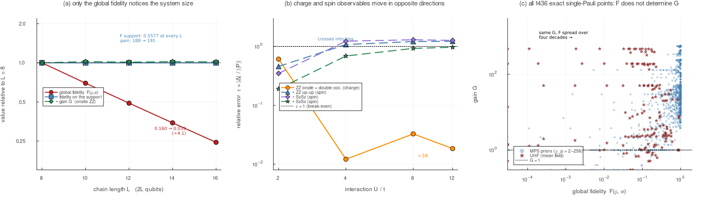
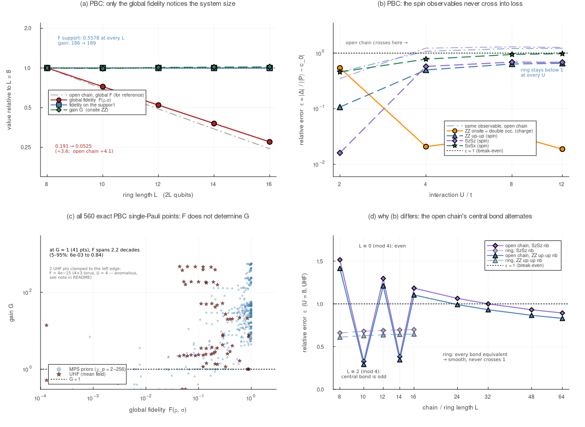
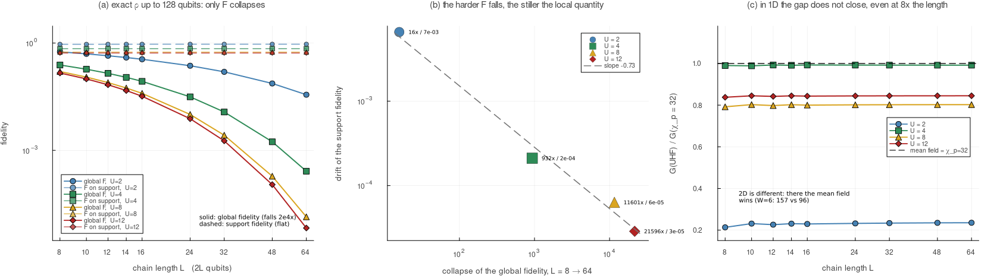
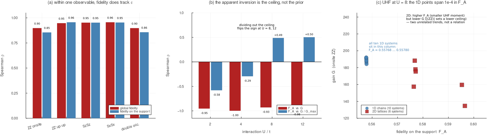
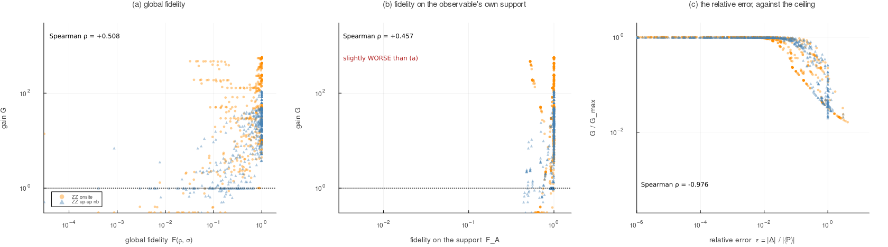
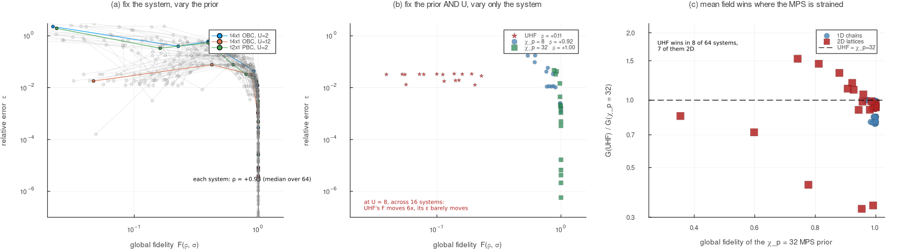

# 厳密基底状態を参照にした prior の総当たり

**1D 鎖と 2D 格子、開放境界と周期境界、 $U=2,4,8,12$ の 88 系について、CRM の prior を総当たりで測った記録。** 参照状態 $\rho$ は厳密な基底状態で、prior $\sigma$ は平均場(UHF)と、参照を $\chi_p$ で切断した MPS である。各点について**利得 $G$ ・大域忠実度・観測量の台に縮約した忠実度**を同時に記録した。全 5530 点。1次元は **$L=64$(128量子ビット)まで厳密**である。

これまで、この3つの量は別々のデータセットに散っており、しかも参照状態が DMRG のものが混ざっていた。ここでは1つのスクリプトで全部を同時に測り直している。

| | |
|---|---|
| **本編** | [README.md](README.md) |
| **§2m(部分系の距離と忠実度)** | [README_2m.md](README_2m.md) |
| **個別の実験(§2b–§9)** | [README_experiments.md](README_experiments.md) |
| **要約** | [SUMMARY.md](SUMMARY.md) |
| **全データ** | [crm_edfid_all.tsv](crm_edfid_all.tsv)(生)/ [crm_edfid_atlas.html](crm_edfid_atlas.html)(絞り込み可) |
| **利得法則の検証** | [README_gainlaw.md](README_gainlaw.md) — 本節の $G$ は全て法則値。128量子ビットまで288点で実測と照合済み |

スクリプト: [crm_2d_ed_fid_table.jl](crm_2d_ed_fid_table.jl) / [.pbs](crm_2d_edfid.pbs) — 1D は $W=1$ として**同じコード**を使うので、次元による方法論の差がない。

---

## この文書の要点

読む前に、結論だけ先に:

0. **大域忠実度は最大2万倍崩れても、台の忠実度と利得は動かない。** $L=8\to64$ 、 $U=12$ で大域 $F$ が 21596倍崩れる間、 $F_{\text{台}}$ の変動は $2.9\times10^{-5}$ 、利得は 2%。しかも**崩壊が激しいほど局所量は安定する**(傾き $-0.73$ のべき則)。
1. **利得を決めるのは相対誤差 $\varepsilon=\lvert\Delta\rvert/\lvert\langle P\rangle\rvert$ であって、忠実度ではない。** ただし「忠実度が使えない」のではなく「**系をまたいで比較すると使えない**」が正確である(検証の節)。
2. **「UHF は $U$ が大きい方が良いか」に単一の答えはない。** 大域忠実度では小さい $U$ 、オンサイト電荷量では大きい $U$ 、サイト間スピン量では小さい $U$ が良い。
3. **平均場が MPS に勝つ条件は、系のサイズではなく「幅」だった。** 1次元では $L$ を8倍にしても比が平坦で追いつかない。 $W\ge4$ の2次元でのみ逆転し、**そこは MPS 参照が作れない領域でもある**。
4. **総予算を固定するなら、利得 $G$ を目的関数にしてはいけない。** $G$ を63倍にする配分が実誤差を10.9倍悪化させる。
5. 相関を見るときは**固定した変数を明記し、変動幅を数値で確認し、 $G$ は天井で割ってから**使う。この節を書く過程で、この3つを守らなかったために3種類の誤りを犯した。

---


## セットアップ

| 項目 | 内容 |
|---|---|
| 参照 $\rho$ | **厳密基底状態**(下記の方法で厳密性を証明) |
| prior $\sigma$ | UHF(平均場)と、参照を $\chi_p$ で切断した MPS($\chi_p=2$ 〜 $256$) |
| 系 | **1D**: $L=8,10,12,14,16$ / **2D**: 2×4, 2×6, 4×3, 4×4 |
| 境界条件 | OBC(開放/シリンダー)と PBC(周期/トーラス) |
| $U$ | **2, 4, 8, 12**($t=1$、半充填) |
| 観測量 | ZZ onsite, ZZ up-up nb, SzSz nb, SxSx nb, 二重占有, $n$, $S^z$ |
| 測定 | 基底あたり $n_m=100$ ショット |
| ランダム基底数 $n_u$ | **指定していない** — 利得の式から約分されて消えるため(下記) |

**72通り(1D 40 + 2D 32)、4424行。**

#### 利得はどう求めたか — サンプリングではなく厳密な閉形式

**この総当たりはシャドウを一度もサンプリングしていない。** モンテカルロではなく、分散の厳密な閉形式に2つの数値を代入して $G$ を出している。

利得法則は、観測量が**単一パウリ文字列**のとき**不等式ではなく等式**になる。このとき両方の推定量の分散が完全に手で書けるからである。台 $A$ 上のパウリ文字列 $P$ を局所ランダムパウリ測定で測るとき、

- ランダム基底が $P$ と一致する確率は $3^{-\lvert A\rvert}$ で、一致したときだけ $3^{\lvert A\rvert}$ 倍して拾う
- 一致した基底での $n_m$ ショットは、平均 $\langle P\rangle$ の $\pm1$ ベルヌーイ試行

の2点だけで、1ユニットあたりの分散が決まる:

```math
\mathrm{Var}_{\text{std}}
= 3^{\lvert A\rvert}\Bigl[\langle P\rangle^2+\tfrac{1-\langle P\rangle^2}{n_m}\Bigr]-\langle P\rangle^2
= (3^{\lvert A\rvert}-1)\langle P\rangle^2+v_s
```

CRM は同じ乱数で $\sigma$ の予測値を引いてから拾うので、 $\langle P\rangle$ が差 $\Delta=\langle P\rangle_\rho-\langle P\rangle_\sigma$ に置き換わるだけである:

```math
\mathrm{Var}_{\text{CRM}}=(3^{\lvert A\rvert}-1)\Delta^2+v_s,
\qquad v_s=\frac{3^{\lvert A\rvert}(1-\langle P\rangle^2)}{n_m}
```

**どちらも全体が $1/n_u$ 倍されるだけ**なので、比を取ると $n_u$ が消えて

```math
G=\frac{(3^{\lvert A\rvert}-1)\langle P\rangle^2+v_s}{(3^{\lvert A\rvert}-1)\Delta^2+v_s}
```

が残る([crm_2d_ed_fid_table.jl](crm_2d_ed_fid_table.jl) の `gain(P, Δ, nA)` がこれである)。**これは漸近形でも上界でもなく、任意の $n_u\ge1$ 、 $n_m\ge1$ で成り立つ厳密な恒等式**である(元論文の Eq. 4 は一般の観測量に対する不等式だが、単一パウリ文字列では等号になる)。したがって $n_u$ には決めるべき値が存在しない。

#### 実際に計算したもの

必要な入力は、系・prior・観測量ごとに**たった2つの数**である:

| 入力 | どこから |
|---|---|
| $\langle P\rangle_\rho$ | 厳密基底状態(DMRG、 `cutoff` →0、エネルギー分散で厳密性を証明) |
| $\langle P\rangle_\sigma$ | prior(UHF Slater 行列式 MPS、または $\chi_p$ 切断 MPS) |

計算コストの実体はここ、つまり**多体状態を厳密に解いて期待値を取る部分**にある。128量子ビットまで押し上げたのもこの部分である。利得はそこから決定論的な関数で出るだけなので、サンプリングを足しても**得られる情報は増えず、統計誤差(反復3000回で約3.7%)が乗るだけ**である。prior 同士の細かい差を比べるのが目的なので、その誤差はむしろ邪魔になる。

#### 法則そのものはサンプリングで検証してある

「式を信じて代入した」だけでは根拠が閉じないので、**法則の側は別に実測で確かめてある**:

| 検証 | 内容 | 結果 |
|---|---|---|
| [README_gainlaw.md](README_gainlaw.md) | 最大128量子ビット、288点 | 実測/法則の**中央値ちょうど 1.0000**、範囲 [0.905, 1.101]、 $\lvert\text{比}-1\rvert$ の95パーセンタイルが 0.059(統計誤差 0.037 に対して)、15%以上ずれた点は **0** |
| 下記「 $n_u$ と $n_m$ の影響」 | $n_u$ を 25→1600(64倍)、 $n_m$ を $1\to10^4$ (4桁) | 全条件で法則値と 0.95〜1.05 で一致 |

つまり**「法則を実測で検証 → 検証済みの法則を総当たりに適用」**という構成である。 $n_u$ が約分で消えることも、式の上だけでなく上表の1行目で実測確認されている。**$n_u$ が決めるのは推定値の絶対精度( $\mathrm{Var}\propto1/n_u$ )だけである。** 一方 $n_m$ はショットノイズ床 $v_s$ に入るので $G$ の値そのものを変える — ただし prior の順位は変えないことを結果2で確認しており、**以下の比較の結論は $n_m=100$ という選択に依存しない**。

#### 適用範囲の限界 — 利得が定義できるのは7観測量のうち2つだけ

等号が成り立つのは単一パウリ文字列に限るので、残りの観測量では $G$ を出していない:

| 観測量 | 単一パウリ | $G$ | 行数 |
|---|---|---|---|
| ZZ onsite | はい | **あり** | 790 |
| ZZ up-up nb | はい | **あり** | 790 |
| SzSz nb / SxSx nb / 二重占有 / $n$ / $S^z$ | いいえ | NaN | 各790 |

パウリ文字列の和になる観測量では法則が不等式に戻るので、[crm_edfid_merge.py](crm_edfid_merge.py) が意図的に NaN を入れている(理由の詳細は下記「表1」の注を参照。恒等成分が分散に寄与しないため、法則に入れるべきは $\langle O\rangle$ ではなく $\langle O\rangle-c_0$ である)。

**この文書の利得に関する結論は全て ZZ 系2観測量(5530行中1580行)のものである。** 残り5観測量については $\varepsilon=\lvert\Delta\rvert/\lvert\langle O\rangle-c_0\rvert$ までしか出しておらず、そこから先(和の観測量で法則の限界を詰める)は未着手の課題として残っている。

#### $\rho$ の厳密性をどう保証したか

セクター Lanczos で ED ベクトルを作ると MPS prior との重なりに表現の変換が要り、4×4 では全空間 $4^{16}$ = 68 GB になって破綻する。そこで **`cutoff=0`、`maxdim` $\ge4^{n/2}$ で DMRG を回す**。この結合次元では MPS はセクター内の任意の状態を誤差なく表せるので、切断が原理的に起こらない。厳密性は**エネルギー分散** $\langle H^2\rangle-\langle H\rangle^2$ で確認する(厳密な固有状態なら 0)。

| 系 | サイト数 | 分散 | 判定 |
|---|---|---|---|
| 1D $L=8$– $14$ | 8–14 | $10^{-15}$ – $10^{-13}$ | **厳密** |
| 1D $L=16$ | 16 | $10^{-14}$ – $8\times10^{-9}$ | **厳密** |
| 2D 2×4, 2×6, 4×3 | 8–12 | $10^{-14}$ – $10^{-13}$ | **厳密** |
| **2D 4×4** | 16 | $2\times10^{-3}$ – $1.2$ | **近似**(集計から除外) |

**72系中64系が厳密**である。4×4 だけは $4^8=65536$ が非現実的なので $\chi=1024$ に留め、以下の集計からは外した(データには残してある)。

#### 台の縮約の検証

台に縮約した RDM は、ITensor の Electron 局所基底 $\lvert0\rangle,\lvert\uparrow\rangle,\lvert\downarrow\rangle,\lvert\uparrow\downarrow\rangle$ を $(n_\uparrow,n_\downarrow)=(0,0),(1,0),(0,1),(1,1)$ と明示的に分解して作る。ZZ up-up のように「2サイトの上向きモードだけ」を残す台があるので、添字順序を取り違えると別の台の忠実度を計算してしまう。そこで**縮約した RDM から求めた $Z\cdots Z$ の期待値が MPO の値と一致するか**を毎回検証している(実測で差 $3\times10^{-16}$)。一致しなければ実行を止める。

---

## 主要な結果

図: [crm_new_fig_edfid.png](crm_new_fig_edfid.png) / スクリプト: [crm_edfid_figure.jl](crm_edfid_figure.jl)



**(a)** 1D 鎖を $L=8$ から $16$ へ伸ばしたときの、 $L=8$ での値に対する比。**落ちるのは大域忠実度だけ**で、台の忠実度と利得は水平のままである(相対値にしてあるので、左右で軸のスケールが違うことによる見かけの効果ではない)。
**(b)** 縦軸は $\varepsilon=\lvert\Delta\rvert/\lvert\langle P\rangle-c_0\rvert$ で、**下にあるほど利得が大きい**( $\varepsilon<1$ が得、 $\varepsilon>1$ が損)。同じ系・同じ prior で $U$ を上げると、電荷量(実線・暖色)の $\varepsilon$ は**下がり**(利得は増え)、スピン量(破線・寒色)の $\varepsilon$ は**上がって $\varepsilon=1$ の線を越える**(利得が 1 を切り、CRM が損になる)。両者は逆を向く。
**(c)** 利得法則が厳密な単一 Pauli 列の全 1436 点(**このパネルだけ OBC と PBC を合わせた全系**。(a)(b) は OBC)。**同じ利得の高さに、大域忠実度が4桁にわたって散らばる**(同じ $G$ の帯で $F$ の 5–95 パーセンタイルが 4.6 桁)。集計を一切せずに、忠実度が利得を決めていないことが見える。

### PBC 版 — 主要な結論は境界条件に依らない。ただし1つだけ依る

図: [crm_new_fig_edfid_pbc.png](crm_new_fig_edfid_pbc.png) / スクリプト: [crm_edfid_pbc_figure.jl](crm_edfid_pbc_figure.jl)



上の3枚を**周期境界(トーラス)だけ**で作り直したものである(PBC の厳密系は 1D $L=8$ – $16$ 、2D 2×4, 2×6, 4×3。単一パウリ点は 560)。

**(a)** OBC と同じである。 $L=8\to16$ で大域忠実度だけが $0.191\to0.0525$ と落ち(÷3.6、OBC は ÷4.1)、**台の忠実度は 0.5578 のまま4桁動かず、利得も 186→189 で動かない**。この文書の中心的な主張は開放端の産物ではない。

**(c)** OBC と同じである。同じ $G$ の帯のなかで大域忠実度が広く散らばる。ただし PBC のデータは $L\le16$ までなので、散らばりは **2.2桁**(最大の帯 $G\approx1$ 、41点、5–95 パーセンタイルで $6\times10^{-3}$ – $0.84$ )と、OBC の 4.6桁 より狭い。**系を大きくできるほど $F$ は下に伸びる**ので、これは主張の強さが系サイズで決まることを示している。

**(b)** **ここだけ違う。** 開放鎖ではスピン量が $U\ge4$ で $\varepsilon=1$ を越えて損に入るのに対し、**リングではどの $U$ でも越えない**(ZZ up-up は最大 0.657、SzSz は 0.690、SxSx でも 0.976)。

**(d)** その理由である。UHF の prior 値は**どの $L$ でも、どちらの境界条件でも同じ**( $\langle S^zS^z\rangle_\sigma=-0.22754$ 、 $\langle ZZ\rangle_\sigma=-0.88085$ )。動いているのは**真値の方**で、開放鎖では観測ボンド(中央ボンド $(\lceil L/2\rceil,\lceil L/2\rceil+1)$ )の**番号の偶奇**で真値が2倍近く振れる:

| $L$ | 8 | 10 | 12 | 14 | 16 |
|---|---|---|---|---|---|
| 中央ボンド番号 | 4(偶) | 5(奇) | 6(偶) | 7(奇) | 8(偶) |
| OBC $\langle S^zS^z\rangle_\rho$ | $-0.0904$ | $-0.1715$ | $-0.0991$ | $-0.1645$ | $-0.1042$ |
| OBC $\varepsilon$ | **1.516** | 0.327 | **1.297** | 0.384 | **1.184** |
| PBC $\langle S^zS^z\rangle_\rho$ | $-0.1370$ | $-0.1354$ | $-0.1347$ | $-0.1342$ | $-0.1339$ |
| PBC $\varepsilon$ | 0.660 | 0.680 | 0.690 | 0.696 | 0.699 |

開放端が誘起するボンド交替(Friedel 振動)のせいで、中央ボンドが交替の山にあるか谷にあるかで真値が変わる。**PBC は並進対称で全ボンドが等価なので、この交替が完全に消える**。実際 PBC の値は OBC の山と谷( $-0.099$ と $-0.171$ )のちょうど間にあり、滑らかに収束する。

> **したがって「スピン量は損に入る」は普遍的な性質ではなく、 $L\equiv0\pmod 4$ の小さい開放鎖の性質である。** OBC でも $L$ を伸ばせば $\varepsilon$ は 1 を下回る(パネル(d): $L=32$ で 1.000、 $L=48$ で 0.931、 $L=64$ で 0.893)。**主要な結果の (b) は、この但し書き付きで読む必要がある。**

#### データ中の既知の異常点(4×3 トーラス、UHF、 $U=4$ )

この1系1条件だけ、UHF の大域忠実度が $U$ に対して $0.888\to3.7\times10^{-15}\to0.056\to0.049$ ( $U=2,4,8,12$ )と、1点で14桁落ちる。台の忠実度は 0.777 と正常なので、**局所的な状態は壊れておらず、大域的な重なりだけが数値的にゼロになっている**。UHF が別の対称性の解に落ちた(あるいは自己無撞着解が別枝に入った)ためと思われ、物理的な滑らかな振る舞いではない。

パネル(c)ではこの2点(観測量2つ分)が左端に張り付いているが、**定量的な主張には使っていない**。散らばりを最大値/最小値ではなく 5–95 パーセンタイルで測っているのはこのためである。

詳細は結果1〜6にあるが、要点はこの3つの表に尽きる。**いずれも中央値ではなく単一の系の実測値**なので、そのまま追える。

#### 表1: 1つの系の全体像 — 大域忠実度 0.078 の prior が、0.83 の prior に勝つ

1D $L=12$、OBC、 $U=8$。 $G$ は**利得法則が厳密な単一 Pauli 列のみ**に載せ、和の観測量は相対誤差 $\varepsilon$ で示す(理由は下の注)。

| prior | 大域 $F$ | $G$(ZZ onsite) | $G$(ZZ up-up) | $\varepsilon$(ZZ onsite) | $\varepsilon$(SzSz) | $\varepsilon$(SxSx) |
|---|---|---|---|---|---|---|
| χ_p=2 | 0.3946 | 29.6 | 1.0 | 0.172 | 1.000 | 1.000 |
| χ_p=4 | 0.8326 | 110.8 | 20.1 | 0.070 | 0.033 | 0.033 |
| χ_p=8 | 0.9923 | 238.2 | 20.6 | 0.002 | 0.002 | 0.002 |
| χ_p=32 | 1.0000 | 238.4 | 20.6 | 0.000 | 0.000 | 0.000 |
| **UHF** | **0.0784** | **190.2** | **0.7** | **0.033** | **1.297** | **0.926** |

1. **UHF は大域忠実度 0.078 と全 prior 中で最低なのに、ZZ onsite の利得 190.2 は $F=0.83$ の χ_p=4(110.8)を上回る。** 忠実度の順位と利得の順位が一致しない。
2. **同じ UHF が観測量によって $\varepsilon=0.033$ から $1.297$ まで振れる。** $\varepsilon>1$ は損( $G<1$ )で、該当する ZZ up-up と SzSz はどちらも UHF がスピン対称性を破った方向である。

> **注: 和の観測量に利得法則を当てはめない理由。** 利得法則は固有値 $\pm1$ の**単一 Pauli 列**について導かれている。二重占有 $n_\uparrow n_\downarrow=(I-Z_a-Z_b+Z_aZ_b)/4$ や $n=I-(Z_a+Z_b)/2$ のような和には**恒等成分**が含まれ、シャドウでは $\mathrm{Tr}[\hat\rho]=1$ がスナップショットごとに厳密なので、**恒等成分は分散にまったく寄与しない**。したがって法則に入れるべきは $\langle O\rangle$ ではなく $\langle O\rangle-c_0$ である( $c_0=\mathrm{Tr}[O]/2^{\lvert A\rvert}$ )。統合表には `c0`, `single_pauli`, `P_fluc` の列を追加し、 $\varepsilon$ を $\lvert\Delta\rvert/\lvert\langle O\rangle-c_0\rvert$ で計算し直したうえで、和の観測量の $G$ と $G_{\max}$ は `n/a` にした。
>
> 検算: 半充填では $\Delta(n_\uparrow n_\downarrow)=\Delta(ZZ)/4$ かつ $\langle n_\uparrow n_\downarrow\rangle-\tfrac14=\langle ZZ\rangle/4$ なので、**二重占有の $\varepsilon$ は ZZ onsite と厳密に一致するはず**である。実際に一致する(差 $10^{-7}$ 、保存桁の丸め)。 $n$ は $\langle n\rangle-c_0=0$ となり $\varepsilon$ が定義されない — 「減らせる分散が最初から無い」ことの正しい表現である。

#### 表2: 系を大きくすると大域忠実度だけが崩れる

UHF、 $U=8$、OBC、ZZ onsite。1D 鎖を $L=8$ から $16$ まで伸ばす:

| $L$ | 量子ビット | 大域 $F$ | $F_{\text{台}}$ | $\varepsilon$ | $G$ |
|---|---|---|---|---|---|
| 8 | 16 | 0.1602 | 0.5577 | 0.0334 | 187.9 |
| 10 | 20 | 0.1116 | 0.5577 | 0.0321 | 192.1 |
| 12 | 24 | 0.0784 | 0.5577 | 0.0327 | 190.2 |
| 14 | 28 | 0.0553 | 0.5577 | 0.0322 | 191.9 |
| 16 | 32 | **0.0391** | **0.5577** | **0.0324** | **191.1** |

**大域忠実度は4分の1に崩れるのに、台の忠実度は小数点以下4桁まで一定、 $\varepsilon$ も利得も動かない。**

$F_{\text{台}}$ が桁で一致するのではなく**同じ数**になるのは、バルクのサイト内 RDM が系のサイズに依らないからである。§2 の主張「大域忠実度が崩壊しても局所利得は生き残る」の、最も直接的な形である — ここでは生き残るどころか**まったく動いていない**。

#### 表3: $U$ を振ると、電荷量とスピン量が逆を向く

同じ系(1D $L=12$、OBC)の UHF。 $\varepsilon$ で示す( $\varepsilon=1$ が損益分岐点):

| $U$ | 大域 $F$ | ZZ onsite(= 二重占有) | ZZ up-up nb | SzSz nb | SxSx nb |
|---|---|---|---|---|---|
| 2 | **0.4417** | 0.609 | **0.458** | **0.348** | **0.190** |
| 4 | 0.1422 | **0.012** | 1.077 | 1.229 | 0.688 |
| 8 | 0.0784 | 0.033 | 1.211 | 1.297 | 0.926 |
| 12 | 0.0680 | **0.018** | 1.222 | 1.267 | 0.968 |

**同じ prior・同じ系で、 $U$ を上げると ZZ onsite は $\varepsilon$ が 0.61 → 0.018 と34分の1になり、スピン量は3つとも $\varepsilon=1$ を越えて損に転じる。** 大域忠実度は 0.44 → 0.068 と単調に悪化する。

つまり「**UHF は $U$ が大きい方が良いのか**」という問いに単一の答えはない:

| 見る量 | 良いのは |
|---|---|
| 大域忠実度 | **小さい $U$** |
| オンサイトの電荷量(ZZ onsite・二重占有) | **大きい $U$** |
| サイト間のスピン量(ZZ up-up・SzSz・SxSx) | **小さい $U$** |

電荷セクターは $U$ が大きいほど Mott ギャップで凍って古典的になるので UHF がよく捉える。スピンセクターは逆で、大きい $U$ では真の状態が量子的に揺らぐ一重項なのに UHF は古典的な Néel 状態なので定性的に間違える。大域忠実度が悪化するのは、Mott 絶縁体では状態がスピン自由度に支配されるからである。

---

### 128量子ビットまで伸ばす — 主張が4桁に強化される

図: [crm_new_fig_edfid_size.png](crm_new_fig_edfid_size.png) / スクリプト: [crm_edfid_size_figure.jl](crm_edfid_size_figure.jl) / 到達範囲の探索: [crm_exact_reach.jl](crm_exact_reach.jl)



当初この総当たりは 1D $L=8$– $16$ に限っていた。**これは物理的な制約ではなく、私の DMRG 設定による自己制約だった。** 見直した結果、**1次元は $L=64$(128量子ビット)まで厳密な $\rho$ が取れる**ことが分かったので、系サイズ依存を測り直す。

#### 何が制約だったか

「厳密」に必要なのは $\chi=4^{n/2}$(最大エンタングル状態の最悪値)ではなく、**実際の Schmidt ランクを超えること**だけである。3点を直した:

| 直した点 | 影響 |
|---|---|
| `cutoff=0` を使っていた | 特異値がゼロでも上限まで結合次元が伸びるので、**必要な $\chi$ が測れず**、常に最悪値を仮定することになっていた |
| 結合次元をランプさせていなかった | 必要が 484 なのに上限 8192 から始めており、 $L=28$ に5.5時間。ランプ後は $L=32$ が **283秒**(70倍速) |
| スイープ不足・ノイズ項なし | $L\ge40$ で Néel 初期状態から局所解に留まり、それを「 $\chi$ の限界」と誤読しかけた。ノイズ項で分散が $2.6\times10^{-6}\to6.8\times10^{-11}$ |

実測した必要 $\chi$(1D OBC、 $U=8$ 、エネルギー分散で厳密性を確認):

| $L$ | 16 | 32 | 40 | 48 | 64 |
|---|---|---|---|---|---|
| 必要 $\chi$ | 235 | 484 | 607 | 685 | **886** |

**$\chi\propto L^{0.96}$ とほぼ線形**である( $\chi/L$ が 14〜15 で一定)。半充填ハバード鎖は電荷ギャップが開いていてスピンセクターの $\log L$ 成長しかないためで、外挿すると $L=128$(256量子ビット)でも $\chi\approx1800$ である。

> **設定変更の照合**: 新旧の設定で $L=16$ を計算し直し、 $E_0$ が小数点以下10桁まで一致、全 prior の $F$ ・ $\Delta$ ・ $F_{\text{台}}$ も一致することを確認した。ランプもノイズも基底状態を変えていない。

#### 結果1: 大域忠実度は最大2万倍崩れ、台の忠実度は動かない

UHF prior、ZZ onsite、 $L=8\to64$(16→128量子ビット):

| $U$ | 大域 $F$ | 崩壊 | $F_{\text{台}}$ の変動 | $G$ |
|---|---|---|---|---|
| 2 | 0.568 → 3.59e−2 | 16倍 | 6.6e−3 | 2.3 → 2.3 |
| 4 | 0.243 → 2.61e−4 | **932倍** | 2.1e−4 | 50.4 → 50.3 |
| 8 | 0.160 → 1.38e−5 | **11601倍** | 6.3e−5 | 187.9 → 192.1 |
| 12 | 0.145 → **6.73e−6** | **21596倍** | **2.9e−5** | 464.6 → 472.3 |

**$U=12$ では大域忠実度が2万倍崩れる間、台の忠実度は $3\times10^{-5}$ しか動かず、利得は 2% しか動かない。** 当初この節が示していた「4.9倍の崩壊」の4000倍強い形である。

#### 結果2: 崩壊が激しいほど局所量は安定する — 傾き $-0.73$ のべき則

図 (b) は、横軸に「大域忠実度の崩壊率」、縦軸に「台の忠実度の変動幅」を取ったものである。**4点が3桁にわたって直線に乗り、傾きは $-0.73$ である。**

両者を結んでいるのは $U$ で、**同じ「局所モーメントの古典性」が片方を安定させ、片方を崩している**:

- $U$ が大きいほど局所モーメントが古典的になり、UHF の Néel 状態がサイト内 RDM をよく捉える。しかもその RDM が系の詳細から切り離されるので、**$F_{\text{台}}$ が $L$ に依らなくなる**
- 同時に、真の状態は量子的に揺らぐ一重項なので UHF の古典 Néel から遠ざかり、その差が $L$ サイト分積み上がる。だから**大域忠実度は激しく崩れる**

大域量と局所量が別方向を向く、という本節の主張の機構レベルの説明になっている。

#### 結果3: 1次元では平均場は MPS に追いつかない — $L$ を8倍にしても

図 (c) は $G(\text{UHF})/G(\chi_p{=}32)$ である。**全ての $U$ で $L$ に依らず平坦**で、1に届かない:

| $U$ | 比( $L=8$ ) | 比( $L=64$ ) | $\chi_p=32$ の大域 $F$( $L=64$ ) |
|---|---|---|---|
| 2 | 0.21 | 0.24 | 0.969 |
| 4 | 0.99 | 0.99 | 0.992 |
| 8 | 0.79 | 0.80 | 0.998 |
| 12 | 0.84 | 0.84 | 0.999 |

**「MPS が張り詰めるほど平均場が有利」の条件は、系のサイズではなく幅だった。** 1次元では局所観測量に必要な $\chi$ が小さく、 $L$ を伸ばしても増えないので、 $\chi_p=16$ 程度で局所量が飽和してしまう( $U=4$ で $\chi_p=16$ 以上は全て $G=50.7$)。

参照状態を作る側でも同じ壁がある。到達範囲を全部測った([crm_exact_reach.jl](crm_exact_reach.jl)、判定は毎回エネルギー分散):

| 幅 | 境界 | サイト数 | 量子ビット | 到達 $\chi$ | 分散 | 判定 |
|---|---|---|---|---|---|---|
| $W=1$ | OBC | 32 | 64 | 484 | 2.4e−9 | 厳密 |
| $W=1$ | OBC | 48 | 96 | 685 | 8.2e−11 | 厳密 |
| **$W=1$** | **OBC** | **64** | **128** | **886** | 8.7e−11 | **厳密** |
| $W=1$ | PBC | 24 | 48 | 8192 | 1.1e−10 | 厳密 |
| **$W=1$** | **PBC** | **32** | **64** | **8192** | 5.6e−10 | **厳密** |
| $W=2$ | OBC | 20 | 40 | 2818 | 6.3e−10 | 厳密 |
| **$W=2$** | **OBC** | **32** | **64** | **4096** | 1.7e−10 | **厳密** |
| **$W=4$** | OBC | **16** | 32 | 6144(上限) | 5.8e−6 | **近似** |
| $W=4$ | PBC | 16 | 32 | 6144(上限) | 7.2e−2 | 近似 |

**$W=4$ では16サイト(32量子ビット)でも厳密化できない。** $W=1$ なら128量子ビット、 $W=2$ でも64量子ビットまで届くので、効いているのはサイト数ではなく**切断の数**である。開放境界の1次元は切断1箇所、周期境界は2箇所、幅 $W$ の2次元は $W$ 箇所で、面積則 $\chi\sim e^{a\cdot(\text{切断数})}$ に従う。実際 $W=1$ の PBC( $\chi=8192$ )と $W=2$ の OBC( $\chi=4096$ )は同程度の難しさで、**周期境界は「幅2の2次元」に相当する**。

> **判定に使えるのはエネルギー分散だけである。** この探索で2度、別の指標から誤った結論を出しかけた。(i) $L\ge40$ の OBC で到達 $\chi$ が上限未満のまま止まったのを「必要な $\chi$ が頭打ち」と読んだが、実際はスイープ不足で局所解に留まっていた(ノイズ項で解消)。(ii) PBC の $L=24$ で $\chi$ が上限に張り付いたのを見て「 $L=28,32$ は届かない」と外挿し、計算の停止を提案したが、**両方とも厳密に届いた**。**到達 $\chi$ が上限に達したことは、不足の証拠にならない** — `cutoff` が小さいと微小な特異値まで保持するので $\chi$ は上限まで伸びる。

> **実用上の含意**: 平均場 prior が MPS に勝つのは $W\ge4$ の2次元(§4・§8 で W=6 では UHF 157 対 $\chi=32$ の 96)だが、**それはまさに MPS 参照が作れない領域でもある**。平均場 prior が最も役に立つ場所と、その有効性を厳密に検証できない場所が一致している。1次元での検証は「平均場が勝つ」ことではなく、「**大域忠実度が崩れても局所利得が残る**」ことの確認として意味を持つ。

#### 結果4: これは UHF 固有の性質ではない

$U=2$ の $\chi_p=32$ を見ると、大域忠実度が $L=8\to64$ で 0.99998 → **0.969** と落ちているのに、利得は 10.8 → 9.7 とほとんど動かない。

**「大域忠実度が崩れても局所利得は残る」は prior の種類に依らない。** 平均場でも MPS でも同じように成り立つ、一般的な現象である。


---

## 詳細な結果

### 結果1: 大域忠実度は $U$ とともに単調に落ち、系サイズとともに指数的に落ちる

UHF の大域忠実度:

| 系 | $U=2$ | $U=4$ | $U=8$ | $U=12$ |
|---|---|---|---|---|
| 1D $L=8$ (OBC) | 0.568 | 0.243 | 0.160 | 0.145 |
| 1D $L=12$ (OBC) | 0.442 | 0.142 | 0.078 | 0.068 |
| 1D $L=16$ (OBC) | 0.352 | 0.085 | 0.039 | 0.033 |
| 1D $L=16$ (PBC) | 0.353 | 0.112 | 0.053 | 0.044 |
| 2D 2×6 (OBC) | 0.419 | 0.184 | 0.114 | 0.095 |
| 2D 2×6 (PBC) | 0.289 | 0.207 | 0.141 | 0.122 |

**HF は弱結合の近似なので、大域忠実度で見れば $U$ が小さいほど良い。** これは素直な期待どおりである。

### 結果2: しかし利得の $U$ 依存は観測量ごとに逆を向く

利得を決めるのは $\varepsilon=\lvert\Delta\rvert/\lvert\langle P\rangle\rvert$ である(§2m 準備)。UHF の $\varepsilon$ を観測量別に見る(厳密な64系の中央値):

| 観測量 | 台 | $U=2$ | $U=4$ | $U=8$ | $U=12$ | 向き |
|---|---|---|---|---|---|---|
| **ZZ onsite** | 2 | 0.606 | **0.017** | 0.032 | **0.018** | 強結合で良い |
| **二重占有** | 2 | 0.268 | **0.023** | 0.188 | 0.237 | 中間結合で最良 |
| $n$ | 2 | 0.000 | 0.000 | 0.000 | 0.000 | 対称性で厳密ゼロ |
| **ZZ up-up nb** | 2 | **0.109** | 0.542 | 0.843 | 0.887 | **弱結合で良い** |
| **SzSz nb** | 4 | **0.248** | 0.626 | 0.900 | 0.918 | **弱結合で良い** |
| **SxSx nb** | 4 | **0.393** | 0.776 | 0.944 | 0.974 | **弱結合で良い** |

**7観測量のうち、強結合を好むのはオンサイトの電荷量(ZZ onsite・二重占有)だけである。** サイト間のスピン量は3つとも $U$ とともに単調に悪化する。

機構は明快である。**電荷セクター**は $U$ が大きいほど Mott ギャップで凍り、二重占有がほぼ古典的になるので UHF がよく捉える。**スピンセクター**は逆で、大きい $U$ では真の状態が量子的に揺らぐ一重項なのに UHF は古典的な Néel 状態なので、スピン相関を定性的に間違える。**大域忠実度が $U$ とともに悪化するのは、Mott 絶縁体では状態がスピン自由度に支配されるから**である。

> つまり「UHF は $U$ が大きい方が良いのか小さい方が良いのか」に**単一の答えはない**。大域忠実度では小さい $U$、電荷量では大きい $U$、スピン量では小さい $U$ が良い。**観測量ごとに見るしかない** — これは §2 の主張そのものである。

### 結果3: 大域忠実度と利得は、極端では逆を向く

この総当たりは、両端の実例を掘り当てた:

| 系 | $U$ | UHF の状態 | **大域忠実度** | $\varepsilon$(ZZ) | **利得 $G$** |
|---|---|---|---|---|---|
| 2D 2×4 トーラス | 2 | 非磁性($m=0$) | **0.902** | 1.000 | **1.00** |
| 1D $L=10$ PBC | 2 | 非磁性($m=0$) | **0.843** | 1.000 | **1.00** |
| 2D 4×3 トーラス | 4 | 磁性($m=0.354$) | **$3.7\times10^{-15}$** | 0.108 | **13.90** |
| 2D 4×3 トーラス | 8 | 磁性($m=0.454$) | $5.6\times10^{-2}$ | 0.013 | **159.6** |

**忠実度 0.902 の prior が利得ゼロ、忠実度 $4\times10^{-15}$(数値的に直交)の prior が利得 13.9。**

上2行の機構も閉じた形で分かる。 $U=2$ のトーラスでは UHF の自己無撞着解が**非磁性解に落ちる**($m=0$)。すると上下スピンが無相関なので $\langle n_\uparrow n_\downarrow\rangle=\langle n_\uparrow\rangle\langle n_\downarrow\rangle=1/4$、したがって $\langle ZZ\rangle_\sigma=4\cdot\tfrac14-1=0$ である。prior は $ZZ$ について**何の情報も持たない**ので $\Delta=\langle ZZ\rangle_\rho$、すなわち $\varepsilon=1$ ちょうど、 $G=1$ ちょうどになる。§2m 準備の損益分岐点そのものである。

下2行は非二部格子(4×3 トーラスは奇環を持つ)で、Néel 型の UHF が定性的に不適切なため対称性の異なる状態に落ち、重なりが数値的にゼロになる。**それでも局所観測量の利得は 13.9 と 159.6 ある。**

### 結果4: 台の忠実度は大域忠実度より桁違いに高いが、それでも利得は予測しない

UHF、ZZ onsite、厳密系の中央値:

| $U$ | 大域 $F$ | $F_{\text{台}}$ | 比 |
|---|---|---|---|
| 2 | 0.4393 | 0.9247 | 2.1倍 |
| 4 | 0.1846 | 0.6970 | 3.8倍 |
| 8 | 0.1130 | 0.5578 | 4.9倍 |
| 12 | 0.0971 | 0.5264 | 5.4倍 |

**台に絞ると忠実度は大きく回復し、 $U$ が大きいほどその差が開く。** これは「局所的には正しい」という直観と合う。ただし §2m 段階2で見たとおり、 $F_{\text{台}}$ もまた**台ごとに1つの数**であって観測量ごとの利得を言い当てはしない($U=12$ で $F_{\text{台}}=0.53$ でも ZZ onsite の $\varepsilon$ は 0.018)。

### 結果5: UHF は何 $\chi$ 相当か

ZZ onsite の利得(厳密系の中央値):

| $U$ | $\chi_p=2$ | $\chi_p=4$ | $\chi_p=8$ | $\chi_p=32$ | **UHF** | UHF の相当 $\chi$ |
|---|---|---|---|---|---|---|
| 2 | 0.21 | 3.71 | 8.71 | 10.07 | **2.33** | $\chi\simeq3$ |
| 4 | 2.12 | 9.07 | 47.11 | 49.87 | **49.74** | **$\chi\simeq32$** |
| 8 | 29.23 | 34.73 | 230.44 | 236.55 | **187.70** | $\chi\simeq8$ |
| 12 | 128.06 | 140.00 | 542.18 | 552.18 | **461.72** | $\chi\simeq8$ |

**$U\ge4$ では、結合次元を持たない平均場が $\chi_p=8$〜 $32$ の MPS に匹敵する。** $U=2$ では $\chi\simeq3$ 相当まで落ちる — 弱結合では平均場が局所相関を捉えられない。

### 結果6: 境界条件の影響は — 電荷量には小さく、スピン量には大きい

UHF、ZZ onsite、厳密系の中央値:

| $U$ | OBC の $G$ | PBC の $G$ | OBC の $F$ | PBC の $F$ |
|---|---|---|---|---|
| 2 | 2.33 | 2.08 | 0.430 | 0.519 |
| 4 | 50.26 | 47.92 | 0.185 | 0.193 |
| 8 | 189.25 | 184.98 | 0.113 | 0.119 |
| 12 | 466.84 | 456.79 | 0.097 | 0.104 |

**平均場 prior は境界条件にほとんど反応しない**(利得の差は2〜3%)。§2k で見た「PBC にすると MPS prior が半減する」のと対照的で、これは平均場が結合次元を持たない — つまり周期境界で余分に切る辺の代金を払わない — ことの直接的な現れである。

> **ただしこれは ZZ onsite(電荷量)に限った話である。** 同じ系・同じ prior でもスピン量では境界条件が決定的で、 $L=12$ 、 $U=8$ の $\varepsilon$ は SzSz で OBC 1.297 / PBC 0.690、ZZ up-up で OBC 1.211 / PBC 0.638 と**約2倍違い、得か損かが入れ替わる**。原因は開放端が誘起する中央ボンドの交替で、上記「PBC 版」のパネル(d)に示した。**「境界条件の影響は小さい」を観測量全体に一般化してはいけない。**

---

## 何が利得を決めているのか

### 観測量ごとに見ると — 忠実度は $\varepsilon$ をよく追う

図: [crm_new_fig_edfid_corr.png](crm_new_fig_edfid_corr.png) / スクリプト: [crm_edfid_corr_figure.jl](crm_edfid_corr_figure.jl)



**(a) 観測量を固定すると、忠実度は prior の相対誤差をよく追う。**

| 観測量 | 大域 $F$ vs $-\log\varepsilon$ | 台の $F$ vs $-\log\varepsilon$ |
|---|---|---|
| ZZ onsite | 0.899 | 0.855 |
| ZZ up-up nb | 0.947 | 0.956 |
| SzSz nb | 0.952 | 0.952 |
| SxSx nb | 0.956 | 0.954 |
| 二重占有 | 0.898 | 0.857 |

0.86〜0.96 である。**全観測量をプールしたときに相関が消えていた**(上の節)**のは、観測量ごとに $\varepsilon$ のスケールが違うからで、忠実度が $\varepsilon$ を追えないからではない。**

ただし $G$ に対しては同じ観測量内でも 0.38〜0.71 に落ちる。 $G$ は $\varepsilon$ と天井 $G_{\max}$ の**両方**で決まり、 $G_{\max}$ は系と $U$ で大きく変わるためである。

**(b)(c) 「UHF では符号が反転する」は誤りだった — 撤回する。**

当初、prior 群で分けると UHF の台の忠実度と $G$ の順位相関が $-1.00$ になることを、平均場に固有の現象として報告した。**これは2つの理由で成り立たない。**

**理由1: 天井の効果である。** $G$ は $\varepsilon$ と天井 $G_{\max}$ の**両方**で決まる。 $G_{\max}$ は $\lvert\langle ZZ\rangle\rvert$ で決まり、系によって 142(2D 4×3)から 239(1D)まで 1.7倍違う。天井で割ると符号が変わる:

| $U$ | $F_A$ vs $G$ | $F_A$ vs $G/G_{\max}$ |
|---|---|---|
| 2 | −0.953 | −0.579 |
| 4 | −0.997 | −0.294 |
| 8 | **−0.929** | **+0.488** |
| 12 | **−0.979** | **+0.503** |

**理由2: そもそも $F_A$ がほとんど動いていない。** $-1.000$ と出た 1D の10点は、 $F_A$ が **0.55768〜0.55780** の幅 $1.2\times10^{-4}$ に固まっている。順位相関は**小数第4位のゆらぎを順位づけているだけ**である。2D の6点だけで見ると $-0.429$ まで落ちる。

実際に起きていたのは、1D と 2D で $F_A$ と $G$ が**別々の理由で**逆向きに動いたことである:

- $F_A$: 2D の方が UHF の局所磁化が小さい( $m\simeq0.45$ 対 1D の $0.47$ )ので分極のずれが小さく、**忠実度は高い**
- $G$: 2D の方が $\lvert\langle ZZ\rangle\rvert$ が小さい(0.78 対 0.85)ので**天井が低く**、利得も低い

因果関係はない。**順位相関を、変動幅と交絡変数を確認せずに解釈したのが誤りだった。**

> なお **(a) の結果はこの訂正の影響を受けない。** 観測量を固定したときに忠実度が $\varepsilon$ を 0.86〜0.96 で追う、という部分は $G$ を経由しないので、天井の問題とは無関係である。
>
> §2m 段階2 の「距離・忠実度による prior 選定は系統的に誤る」という結論も変わらない。そこでの根拠は $\Delta$ が対称性破れの方向に食われることであって、ここで撤回した符号反転ではない。

### 台の忠実度に替えても改善しない — では何が決めているのか

図: [crm_new_fig_edfid_what_predicts.png](crm_new_fig_edfid_what_predicts.png) / スクリプト: [crm_edfid_fid_figure.jl](crm_edfid_fid_figure.jl)



上の (c) の横軸を**台の忠実度**に差し替えたものが (b) である。 利得法則が厳密な単一 Pauli 列 1119 点で順位相関を取ると:

| 横軸 | $G$ との順位相関 |
|---|---|
| (a) 大域忠実度 | +0.508 |
| (b) **台の忠実度** | **+0.457** |
| (c) 相対誤差 $\varepsilon$(縦軸は $G/G_{\max}$ ) | **−0.976** |

**台に絞っても改善しない。それどころかわずかに悪い**(+0.457 対 +0.508)。

これは §2m 段階2 の結論と整合する。台に絞っても $F_A$ は「**台ごとに1つの数**」であることは変わらないので、prior・系・ $U$ を横断してプールすれば予測力を失う。(b) で点が $F_A\simeq1$ の細い帯に潰れているのはそのためで、**忠実度がほぼ 1 の点が利得 1 から 300 までを覆っている**。

(c) は対照である。 $\varepsilon$ に対しては $-0.976$ とほぼ決定的になる。

> **ただし (c) は法則の検証ではない。** ここでの $G$ は $\varepsilon$ と $G_{\max}$ から利得法則で計算した値なので、その意味では循環している。この図が示しているのは「**情報がどの変数に乗っているか**」であって、法則が正しいことではない(法則自体の検証は §1 で経験値に対して行っている)。
>
> 縦軸を $G$ ではなく $G/G_{\max}$ にしたのは、 $1/G=\varepsilon^2(1-1/G_{\max})+1/G_{\max}$ より $G$ が $\varepsilon$ と天井の**両方**で決まるからである。観測量や系によって $G_{\max}$ が 1 から 500 まで違うので、 $G$ を直接 $\varepsilon$ と比べると関係が薄まる。

---

## $n_u$ と $n_m$ の影響

スクリプト: [crm_nunm_study.py](crm_nunm_study.py) / [crm_budget_split_check.py](crm_budget_split_check.py)

§10 は全て $n_u$ を明示せず $n_m=100$ 固定で計算していた。両者の役割はまったく違うので、分けて確かめる。台=サイト内2量子ビットなので、 $\rho_A$ の周辺分布だけで**シャドウ測定を厳密にシミュレートできる**(1D $L=12$ 、OBC、 $U=8$ 、onsite ZZ)。

```math
\mathrm{Var}=\frac{1}{n_u}\Bigl[(3^{\lvert A\rvert}-1)\Delta^2+v_s\Bigr],
\qquad v_s=\frac{3^{\lvert A\rvert}(1-\langle P\rangle^2)}{n_m}
```

$n_u$ は分散全体の前係数なので、**比である $G$ では厳密に約分されて消える**。 $n_m$ はショットノイズ床 $v_s$ に入るので $G$ を変える。

#### 結果1: $n_u$ は利得に影響しない(実測で確認)

$n_u$ を 25 から 1600 まで64倍振っても、実測利得は法則値のまわりを動くだけである:

| prior | $n_m$ | $n_u=25$ | $n_u=100$ | $n_u=400$ | $n_u=1600$ | 法則値 |
|---|---|---|---|---|---|---|
| χ_p=4 | 1 | 3.25 | 3.48 | 3.33 | 3.37 | **3.34** |
| χ_p=4 | 10 | 21.40 | 21.05 | 22.98 | 22.70 | **22.19** |
| UHF | 100 | 194.3 | 191.6 | 195.4 | — | **190.2** |

ばらつきは反復回数 4000 に対応する統計誤差(約3%)の範囲内である。**$n_u$ が決めるのは推定値の絶対精度( $\mathrm{Var}\propto1/n_u$ )だけで、利得ではない。**

これは同時に**利得法則の追加検証**にもなっている。§1 は8量子ビット1系での検証だったが、ここでは 24量子ビットの系で、 $n_m$ を4桁・ $n_u$ を2桁振った全条件で法則値と 0.95〜1.05 で一致した。

#### 結果2: $n_m$ は利得を変えるが、prior の順位は変えない

| prior | $\varepsilon$ | $n_m^\ast$ | $n_m{=}1$ | $n_m{=}100$ | $n_m{=}10^4$ |
|---|---|---|---|---|---|
| χ_p=2 | 0.172 | 14 | 3.2 | 29.6 | **33.6** |
| χ_p=4 | 0.070 | 87 | 3.3 | 110.8 | **204.4** |
| **UHF** | 0.033 | 395 | 3.4 | 190.2 | **901.8** |
| χ_p=8 | 0.0020 | $1.1\times10^5$ | 3.4 | 238.2 | 21751 |
| (天井 $G_{\max}$ ) | | | 3.4 | 238.4 | 23743 |

$n_m^\ast=3^{\lvert A\rvert}(1-\langle P\rangle^2)/[(3^{\lvert A\rvert}-1)\Delta^2]$ が境目で、 $G/G_{\max}=1/(1+n_m/n_m^\ast)$ である(§0.5b)。 $n_m\ll n_m^\ast$ では天井に張り付き prior の質が効かない。 $n_m\gg n_m^\ast$ で prior の質が頭打ちを決める。χ_p=2 は $n_m^\ast=14$ なので $n_m=100$ で既に飽和し、 $10^4$ にしても 33.6 止まりである。

**重要なのは、これが $G$ の絶対値だけを動かし、prior の順位を変えないこと。** 同じ系では $\langle P\rangle$ が共通なので $G$ は $\lvert\Delta\rvert$ の単調減少関数になり、順序が $n_m$ に依らない。実際「UHF が χ_p=32 を上回る系」は $n_m=1$ から $10^4$ まで **8/64 で不変**である。**§10 の比較の結論は $n_m$ の選び方に依存しない。**

#### 結果3: 総予算を固定すると、利得を最大化してはいけない

$B=n_u\times n_m$ を固定すると

```math
\mathrm{Var}_{\rm CRM}=\frac{1}{B}\Bigl[(3^{\lvert A\rvert}-1)\Delta^2\,n_m+3^{\lvert A\rvert}(1-\langle P\rangle^2)\Bigr]
```

で、 $n_m$ について**単調増加**である。 $B=10^4$ で実測すると:

| prior | $n_m$ | $n_u$ | $G$ | **CRM の実誤差** | 最良比 |
|---|---|---|---|---|---|
| χ_p=4 | **1** | 10000 | 3.3 | **0.0159** | **1.00** |
| χ_p=4 | 10 | 1000 | 21.9 | 0.0165 | 1.04 |
| χ_p=4 | 100 | 100 | 112.2 | 0.0230 | 1.44 |
| χ_p=4 | 1000 | 10 | 189.4 | 0.0555 | 3.49 |
| χ_p=4 | **10000** | 1 | **207.0** | **0.1727** | **10.86** |
| UHF | **1** | 10000 | 3.4 | **0.0159** | **1.00** |
| UHF | 100 | 100 | 193.5 | 0.0173 | 1.09 |
| UHF | **10000** | 1 | **934.3** | **0.0799** | **5.02** |

**χ_p=4 では、利得が 3.3 から 207 へ 63倍になる配分が、実際の誤差では 10.9倍悪い。** 利得は「標準シャドウに対する比」でしかなく、 $n_m$ を増やすと標準シャドウの方が急速に悪化するので比が伸びるだけである(標準の誤差は 0.029 → 2.48 と85倍悪化している)。

> **$G$ を目的関数にしてはいけない。** 総予算が決まっているなら $n_m$ は小さいほどよく、極限は $n_m=1$ である。 $G$ が大きく見える配分は、標準シャドウを不利にしただけの見かけである。§0.5b で理論的に述べた点を、ここでサンプリングで確認した。
>
> ただし実験では基底の切り替えにコストがあるので $n_m=1$ は現実的でない。切り替えコストを $c$ ショット相当とすると最適は $n_m^{\rm opt}=\sqrt{cn_m^\ast}$ である(§0.5b)。 $n_m^\ast$ が prior に依存するので、**最適な配分は prior の質に依存する** — χ_p=4 なら $n_m^\ast=87$ 、UHF なら 395 、χ_p=8 なら $10^5$ である。

---

## 検証: これまでの主張はどこまで成り立つか

図: [crm_new_fig_edfid_synth.png](crm_new_fig_edfid_synth.png) / スクリプト: [crm_edfid_synth_figure.jl](crm_edfid_synth_figure.jl)



72系4424点が揃ったので、これまでの主張を一つずつ当て直した。**3つに限定が必要だった。**

### 成り立つもの

| 主張 | 検証 |
|---|---|
| 利得法則(単一 Pauli 列で厳密) | §1 で経験値と5.9桁一致 |
| $\varepsilon$ が利得を決める | $\varepsilon$ vs $G/G_{\max}$ の順位相関 $-0.969$( $ZZ$ onsite)、 $-0.984$(ZZ up-up) |
| $U$ 依存が電荷とスピンで逆を向く | スピン3量すべて単調悪化(ZZ up-up 0.109→0.887、SzSz 0.248→0.918、SxSx 0.393→0.974)、ZZ onsite のみ改善 |
| $\lvert\Delta\rvert\le2D_A$ と閉形式 $2/[\max(1,m)+\max(1,\sigma)]$ | 24点で最大誤差 0.0022(§2m) |
| 恒等成分の除去 | 二重占有の $\varepsilon$ が ZZ onsite と厳密一致 |

### 限定1: 「大域忠実度は利得を決めない」は、変数の固定の仕方による

相関を2通りに分解する:

| 変動のさせ方 | $F$ vs $-\log\varepsilon$ |
|---|---|
| **系と $U$ を固定し、prior だけ変える** | **+0.93**(64系の中央値) |
| **prior と $U$ を固定し、系だけ変える**(UHF) | **+0.11** |

**同じ系の中で prior を並べる分には、忠実度は正しく順序づける**(図 a)。破綻するのは系をまたぐときで、UHF では $F$ が6倍動く間に $\varepsilon$ がほとんど動かない(図 b)。

正確には「忠実度は使えない」ではなく「**系をまたいで比較すると使えない**」である。§2 の主張(系を大きくすると $F$ が指数的に死ぬが局所利得は生きる)は後者の形であり、そのまま成り立つ。

内部整合性も確認した。 $F$ vs $-\log\varepsilon$ が $0.899$ 、 $F$ vs $G/G_{\max}$ が $0.898$ 、 $F$ vs $G$ が $0.460$ — **天井を割った量とは同じ相関、生の $G$ だけ薄まる**という予測どおりである。

### 限定2: 「平均場が MPS に勝つ」は、MPS が張り詰めている系に限る

今回の ED 系(8〜16サイト)で UHF が $\chi_p=32$ を上回るのは **64系中8系のみ**、うち **7系が2D**である(図 c)。勝つ系はすべて $\chi_p=32$ の大域忠実度が 0.93 以下で、負ける系では $\chi_p=32$ がほぼ厳密(全64系の中央値 0.995)である。

つまり **ED で届く小さい系では MPS が有利**で、平均場が勝つのは MPS が張り詰めるとき — 2次元、周期境界、大きい系 — である。§4・§8 の 64/96量子ビットでの結果(W=6 で UHF 157 対 $\chi=32$ の 96)と整合する。

### 限定3: 「 $F_{\text{台}}$ は系サイズに依らない」は1次元の性質

UHF、 $U=8$ 、ZZ onsite:

| | 大域 $F$ の幅 | $F_{\text{台}}$ の幅 | $G$ の幅 |
|---|---|---|---|
| 1D(10系) | 4.9倍 | **1.000倍** | 1.04倍 |
| 2D(6系) | 4.1倍 | 1.035倍 | 1.40倍 |

1次元では厳密に一定だが、2次元では 3.5% 動く。

### 方法論として記録しておくこと

この節を書く過程で、相関の扱いで**3種類の誤り**を実際に犯した。いずれも一度は結論として書きかけたものである。

1. **何を固定したかを明示しない。** 「prior を固定して系を変える」と題しながら $U$ をプールしていた。UHF は $U$ とともに $F$ も $\varepsilon$ も下がるので、 $U$ を混ぜると $-0.61$ という「 $U$ 依存を測っただけの数字」が出る。 $U$ を固定すると $+0.11$ になる。
2. **変動幅を確認せずに相関を解釈する。** 1D の10点は $F_{\text{台}}$ が $1.2\times10^{-4}$ しか動いていないのに、順位相関は $-1.000$ を返した。順位統計量は**単調性だけを見て変動幅を見ない**。
3. **合成量である $G$ をそのまま相関に使う。** $G$ は $\varepsilon$(prior が決める)と $G_{\max}$(系と $U$ が決める)の合成なので、系をまたぐ相関では必ず天井が混ざる。 $G/G_{\max}$ にすると符号が変わることがある。

**相関を見るときは、固定した変数を明記し、変動幅を数値で確認し、 $G$ は天井で割ってから使う。**

---

## データの使い方

[crm_edfid_all.tsv](crm_edfid_all.tsv) は 1行 = (系, 境界条件, $U$ , prior, 観測量) の 4424 行、22 列:

| 分類 | 列 | 備考 |
|---|---|---|
| 系 | `dim W LX nsites geometry bipartite U` | `bipartite` が `false` なら奇環を持つ(4×3 トーラスのみ) |
| 参照の質 | `Eref Hvar exact` | `exact` は $\lvert\langle H^2\rangle-\langle H\rangle^2\rvert<10^{-8}$ |
| prior | `prior global_fid` | |
| 観測量 | `observable nA c0 single_pauli` | `c0` は恒等成分の係数、`single_pauli` が `true` の行だけ利得法則が厳密 |
| 忠実度・距離 | `F_supp D_supp` | 観測量の**台**に縮約したもの |
| 誤差と利得 | `true P_fluc Delta eps G G_max` | `P_fluc` $=\langle O\rangle-c_0$ 。 `G` と `G_max` は和の観測量では `NaN` |

**集計するときは `exact == yes` で絞ること。** 4×4 の8系は $\chi=1024$ では厳密にならず、エネルギー分散が $2\times10^{-3}$ 〜 $1.2$ ある(データには残してある)。

[crm_edfid_atlas.html](crm_edfid_atlas.html) は同じ内容を次元・サイズ・境界条件・ $U$ ・prior・観測量で絞り込める形にしたもの。選択中の行の中央値も出る。

## 図の一覧

| 図 | 何を示すか |
|---|---|
| [crm_new_fig_edfid.png](crm_new_fig_edfid.png) | (a) 系を伸ばすと大域忠実度だけが崩れる (b) $U$ で電荷量とスピン量が逆を向く (c) 全点で $F$ が $G$ を決めていない |
| [crm_new_fig_edfid_pbc.png](crm_new_fig_edfid_pbc.png) | 上の PBC 版。(a)(c) は OBC と同じ結論、**(b) だけ違い**、(d) がその理由(開放鎖の中央ボンドの偶奇による交替) |
| [crm_new_fig_edfid_what_predicts.png](crm_new_fig_edfid_what_predicts.png) | 大域忠実度・台の忠実度・ $\varepsilon$ のどれが利得を決めるか |
| [crm_new_fig_edfid_corr.png](crm_new_fig_edfid_corr.png) | 観測量ごとの相関と、見かけの逆相関が天井の効果であること |
| [crm_new_fig_edfid_synth.png](crm_new_fig_edfid_synth.png) | 忠実度が使えるのはどういうときか / 平均場が勝つのはどういうときか |

## 次にやること

**(a) 平均場の逆転を、忠実度の閾値ではなくエンタングルメントエントロピーで特徴づける。** 現状は「 $\chi_p=32$ の忠実度 0.93 以下で勝つ」という相関止まりである。必要な $\chi$ が $S$ で決まることは §2e で見ているので、横軸を $S$ に取れば1本の曲線になるはずである。ED で届く範囲では $S$ が小さすぎるので、DMRG 参照で 2D の幅を W=4, 6, 8 と変える必要がある。

**(b) ドープ系。** ここは半充填のみである。 $\delta=1/8$ で同じ総当たりをやれば、**粒子正孔対称性が破れて $m\ne0$ になる**ので、§2m の閉形式 $2/[\max(1,m)+\max(1,\sigma)]$ の $m>0$ 側を初めて直接検証できる(現状 $m>0$ の点が存在しない)。§9 の「安い prior の相図」の ED 参照版にもなる。

**(c) 対称性回復の系統化。** §2j で群平均がコスト0で効くことは示したが、ここには UHF-sym を含めていない。 $U$ と次元を振った空間で回復量を測れば、§2m の $r\le1/4$ を**実際に満たしにいく**手順になる。
